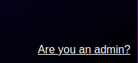
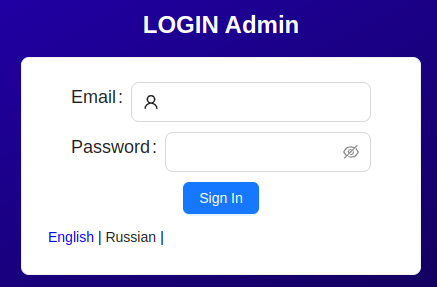
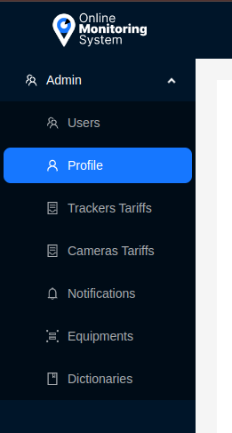

# Administrator

The **Administrator** in the system has full rights and responsibility for managing all aspects of its functioning. They have privileges to manage users, tariff settings, equipment configuration, as well as creating and sending notifications. Additionally, the administrator ensures control over the available interface languages for users, ensuring ease of use for all participants.

## Authorization

The Administrator has a separate login page in the system. You can access it from the main authorization page by clicking on the link in the bottom right corner.

After navigating to it, the administrator needs to enter their login credentials and click the `Sign In` button.

## Abilities

The Administrator has a sidebar menu different from the user's:

- Users - User management.
- Profile - Editing the administrator's profile.
- Tracker Tariffs - Managing tracker tariffs.
- Camera Tariffs - Managing camera tariffs.
- Notifications - Managing notifications.
- Equipments - Managing equipment.
- Dictionaries - Managing language dictionaries.

More detailed information is described in the corresponding sections.
