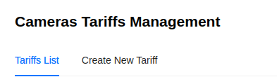
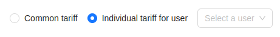
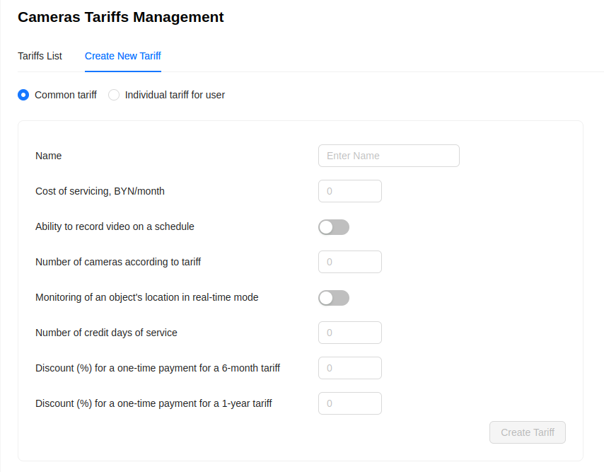

# Camera Tariffs

The administrator has the ability to create new camera tariffs and view information about them. For this, there are 2 tabs on the camera tariffs page:

## List of Tariffs

:::warning Attention
    This page is under development.
:::

## Creating a New Camera Tariff

1. Go to the ***Create New Tariff*** tab.
2. Choose whether the tariff will be general or individual.

- If the tariff is general, it will be available to all platform users for selection.
- If the tariff is individual, the Administrator must select the user from the dropdown list who will have access to this tariff. Other users will not be able to use it.

3. Fill out the tariff creation form - specify the necessary values as well as the camera's capabilities under this tariff.

4. Click the `Create Tariff` button.

After that, the new tariff will become available to all users for whom it was created.
