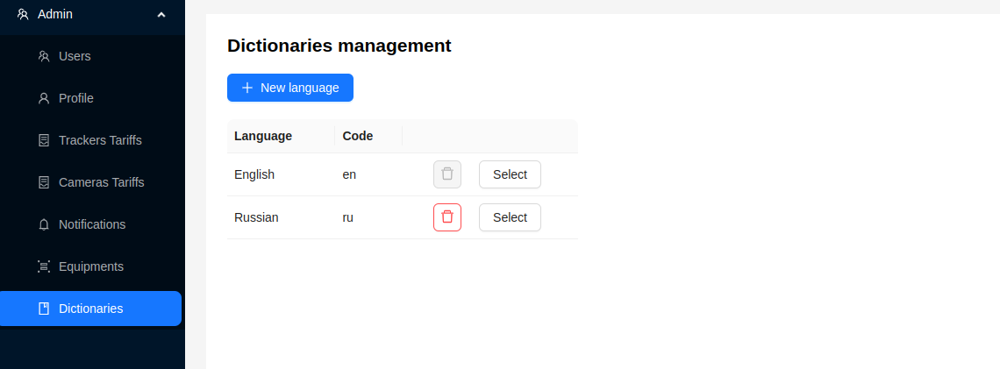
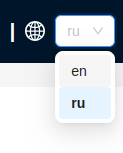
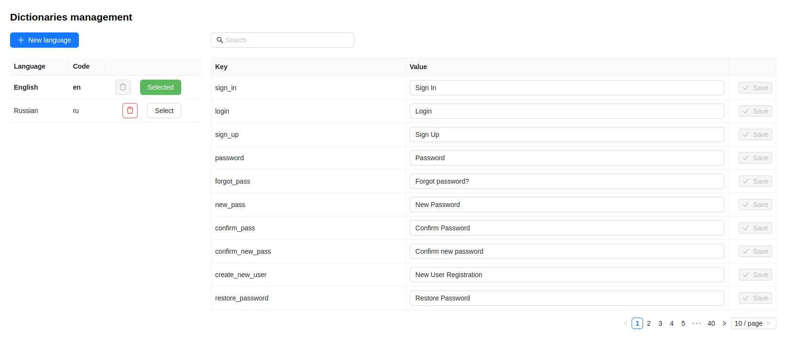
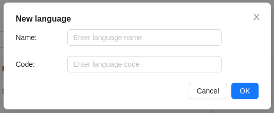
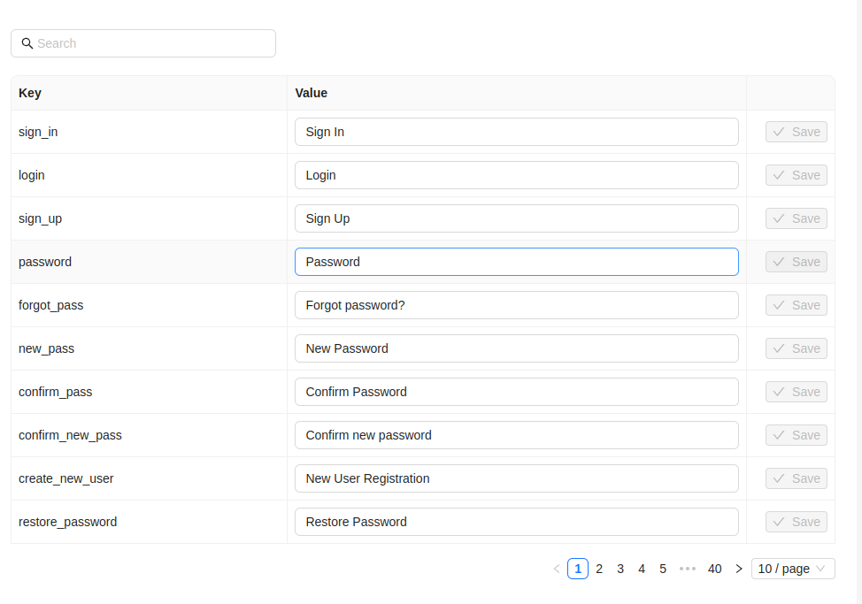
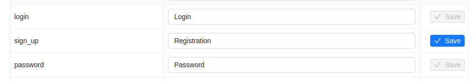
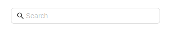

# Dictionaries

The administrator can manage language dictionaries in the system, which are available to users, by adding new ones or modifying existing ones.

 

When using the platform, users can choose the desired language dictionary on the login page as well as in the top panel.

 

To view a language dictionary, the administrator needs to click the `Select` button, after which an additional window with the dictionary will open.

 

## Adding a New Dictionary

1. To add a new dictionary, click the `+ New Language` button.
2. Fill out the form that appears, specifying the language name and a brief code.

 

3. Click the `Add` button.

A new dictionary by default has translations in English. To change the translations, the administrator needs to [edit the dictionary](/admin/dictionaries#editing-a-dictionary).

## Editing a Dictionary

To edit translations for an existing or created dictionary, click the `Select` button, after which a window with translations will open, and the button will turn green.

The translation window consists of a table with several columns:
1. ***Key*** - the system key of the translation, by which the platform identifies the translation data.
2. ***Value*** - the editable translation value, which is the translation displayed in the user interface when this dictionary is selected.
3. The `Save` button to save changes.

 

To apply a new translation to the dictionary, enter the new translation value and click the `Save` button. Translation values are also saved by pressing the `Enter` key on the keyboard.

 

In addition to editing, the translation window has a search field for searching the table. Search can be performed by the ***Key*** or ***Value*** columns, with case sensitivity.

 

At the bottom, there is pagination for easy navigation, with options to navigate between pages and choose the number of rows displayed per page.

## Deleting a Dictionary

To delete a dictionary, click the delete button next to the desired dictionary.

 

:::warning Important
The platform has a default language - **English (en)**. It is set when no other dictionaries are present. The administrator cannot delete it but can change translations.
:::
