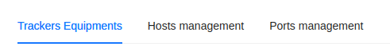
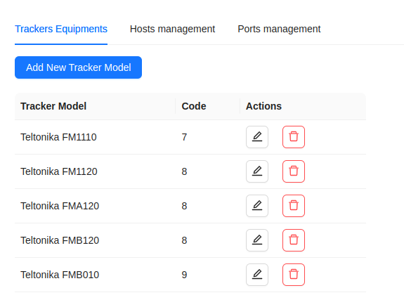
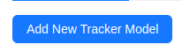
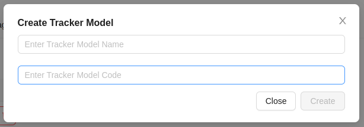
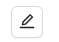
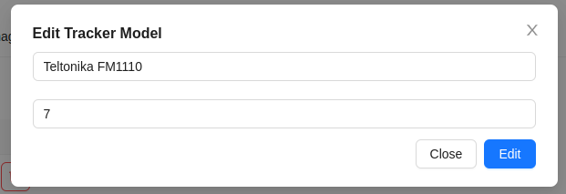
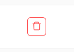
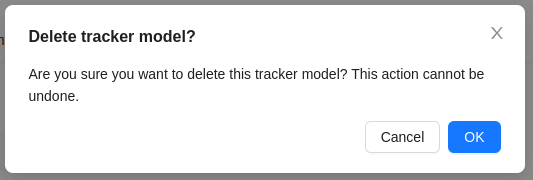

# Equipment Management

Here, the administrator has the ability to manage GPS tracker models, hosts, and ports. Three tabs with corresponding functionality are located on the page.

## Tracker Models

Here is a list of [tracker models](/trackers/intro) available in the system for users to choose from.

### Creating a New Tracker Model
1. Click the `Add New Tracker Model` button.

2. Fill out the form according to the GPS device documentation.

3. Click the `Create` button.

### Editing a Tracker Model
1. Click the edit button  next to the desired model. 
2. In the opened form, modify the necessary data.

3. Click the `Edit` button.

### Deleting a Tracker Model
1. Click the delete button next to the desired model. 

 

2. Confirm the deletion of the tracker model by clicking the `Ok` button.

## Host Management

:::warning Attention
    Page under development.
:::

## Port Management

:::warning Attention
    Page under development.
:::
