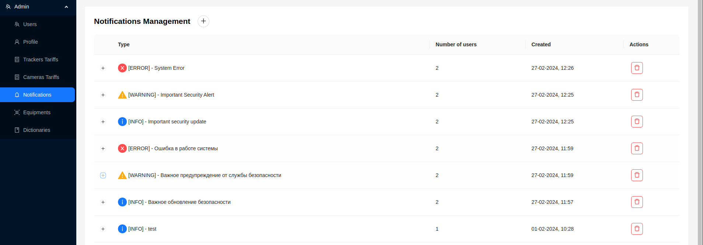
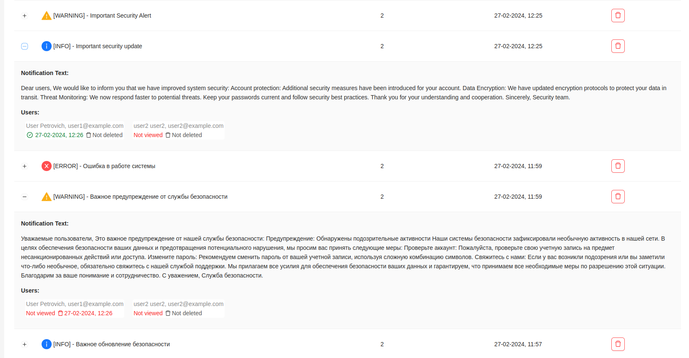
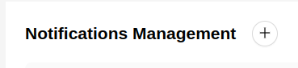
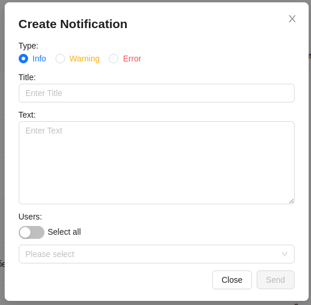
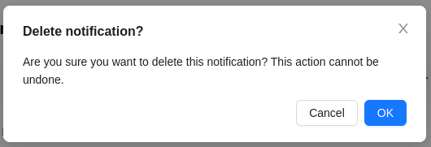

# Notification Management

The administrator can create notifications for users and manage their delivery. The notifications page provides information about all notifications with the ability to view them.

The general information available to the administrator includes the notification type, title, the number of users to whom the notification was sent, and the creation date. Each entry in the table can be expanded to view more detailed information:

- Notification text.
- Users to whom the notification was sent, with their email and name.
- Date the notification was viewed, if it was viewed, or ***Not viewed*** if not.
- Date the notification was deleted, if it was deleted by the user, or ***Not deleted***.

## Creating Notifications

1. To create a new notification, the administrator needs to click the button at the top of the page.

2. After that, a form for creating a new notification will appear.

3. Choose the notification type - ***Information***, ***Warning***, or ***Error***.
4. Enter the notification title.
5. Enter the notification text.
6. Select from the dropdown list which users should receive the notification. By enabling the ***Select all*** option, all platform users will be selected to receive the notification.
7. Click the `Send` button.

## Deleting Notifications

1. To delete a notification from the list, click on the red trash can icon.

2. Then confirm the action by clicking the `Ok` button.

