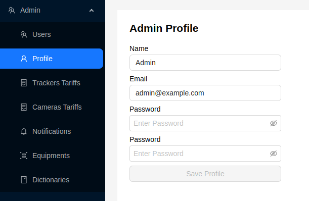

# Profile

The administrator's profile page allows editing the administrator's information.

The administrator can edit the following fields:
1. Administrator's name
2. Email
3. Password
4. Field for re-entering the password

To save the data, click the `Save Profile` button.
