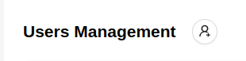

# User Management

The administrator can see a list of all platform users. The page displays general information about users - name, email, phone, registration date in the system. There are also buttons for [editing](/admin/users#editing-a-user), [deleting](/admin/users#deleting-a-user), [connecting](/admin/users#connecting-a-user), and [recharging a user's balance](/admin/users#recharging-a-user-s-balance).

 

## User Details

The administrator can click on the `+` icon in the first column of the user row to view detailed information about the user.

 

The following information is provided here:
1. Name - user's name.
2. Mail Verified - indicator of email confirmation by the user.
3. Balance - current user balance.
4. UNP - payer's account number.
5. Registered - user registration date.
6. User Type - Individual or Legal entity.
7. Phone - user's phone number.
8. Legal Address.
9. Bank Account.
10. Email - user's email.
11. Additional Information about the user.
12. Postal Address.
13. Bank.
14. Prefered map

Buttons:

1. `Send Activation Email` - sends an activation email to the user's specified email address.
2. `Activate User` - activates the user, granting access to the platform functionalities.
3. `Deactivate User` - deactivates the user, restricting access to the platform functionalities.

## Creating a New User by the Administrator

The process of creating a new user by the administrator is similar to [registering a new user](/#registration) in the system.
1. To create a new user, the administrator needs to click on the button at the top of the page.

 

2. Enter user data in the opened form.

 

3. Click the `Sign Up` button.

4. The user will be added to the general list in an inactive status. If necessary, click the `Activate User` button to activate the account.

## Editing a User

1. Click the edit button  next to the user.
2. Modify the user's data in the opened form.

 

3. Click the `Save Profile` button.

## Connecting a User

The platform allows the administrator to manage the system on behalf of a user. This allows the administrator to access the monitoring objects, trackers, and cameras of the user, with some additional capabilities.

To connect a user, the administrator needs to click the blue `Connect` button next to the selected user.

 

After that, the administrator interface will look like this:
1. In the sidebar, in addition to the administrator's capabilities, additional sections will appear, repeating the set of the user's sidebar.
2. The user's email will appear in the top panel, with a blinking connection indicator on the left and a button to disconnect the user on the right.

 

In this mode, the administrator can perform the following functions on behalf of the user:
1. View, edit, add, delete [monitoring objects](/category/monitoring-objects), [trackers](/category/trackers-management), [cameras](/category/online-cameras), and share them.
2. View the user's [transaction history](/myAccount/balance) and make [payments for tariffs](/myAccount/payments).
3. View the available user [tariffs](/tariffs).
4. Leave [feedback](/feedback) on behalf of the user.
5. View the user's [notifications](/notifications).
6. [Refill](/admin/users#refill-the-users-balance) the user's balance or [cancel recent transactions](/admin/users#canceling-transactions).

### Disconnecting a User

To disconnect from the user's account, click the disconnect button in the top panel.

 

Or click the `Disconnect` button on the user's page.

## User Balance Management

### Refill the User's Balance

The administrator has the ability to recharge the balance of the selected user. This can be done in two ways:

***Through the User's Page***:
1. Click the green `Refill Balance` button next to the user.

 

2. Specify the recharge amount in the opened window.

 

3. Click the `Refill Balance` button.

***Through the [User Connection Mode](/admin/users#connecting-a-user)***

1. Connect the user by clicking the `Connect` button.

 

2. Go to the ***My Account / Balance*** page.
3. Here, the administrator will see the `Refill Balance` button, which needs to be clicked. 

 

4. Specify the recharge amount in the opened window.

 

5. Click the `Refill Balance` button.

### Canceling Transactions

The administrator has the ability to cancel user transactions.
To do this:
1. Go to the [User Connection Mode](/admin/users#connecting-a-user).
2. Go to the ***My Account / Balance*** page.
3. For the last transaction, the administrator will see the `Cancel` button.

 

4. Click the `Cancel` button to cancel the last transaction. After that, this transaction will disappear from the list, and the next transaction after it will become available for cancellation. The balance value will return to its value before the canceled transaction.

## Deleting a User

1. Click the delete button next to the user you want to delete.

 

2. Confirm the deletion of the user by clicking the `Ok` button.

