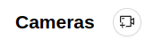
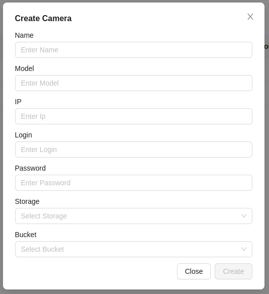

# Adding a Camera
1. To add a new video camera, click the button at the top of the **Cameras** page.

2. Then, a form will appear that needs to be filled out:

- Name - the name of the camera for user identification.
- Model - the model of the camera being used.
- IP - the IP address of the video camera.
- Login - the login for connecting to the video camera.
- Password - the password for connecting to the video camera.
- Storage - selecting the storage location for saving video recordings. More details in the [relevant section](/cameras/storages).
- Trash - selecting the storage trash bin for storing video recordings. More details in the [relevant section](/cameras/storages).

3. Click the `Create` button. If the data is entered correctly, the newly created video camera will appear in the list.
