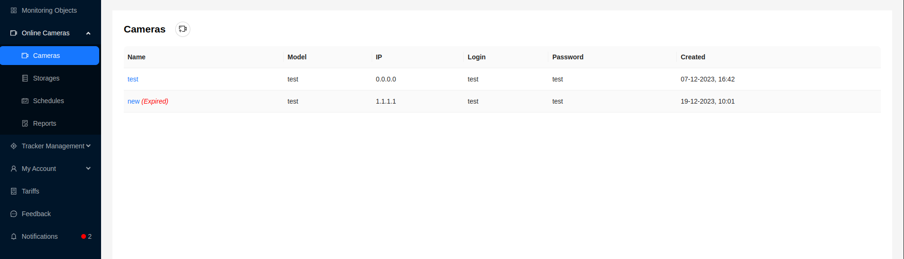
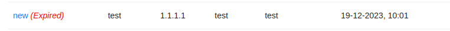
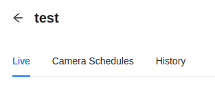
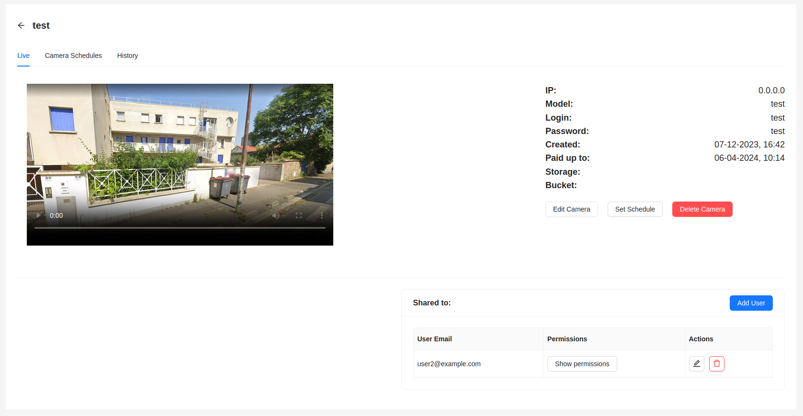
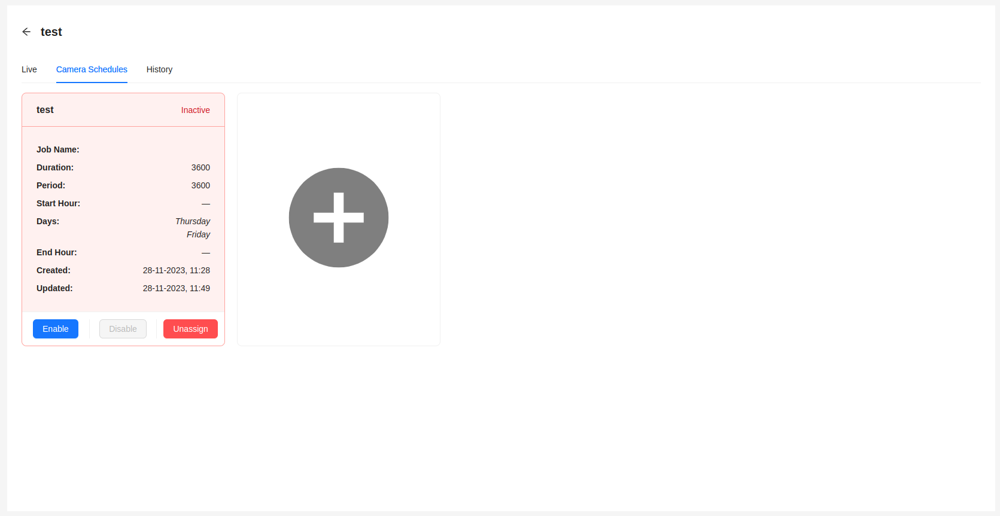
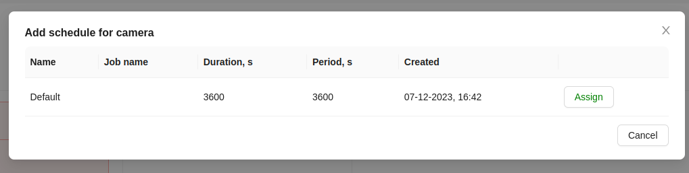

# Cameras

The system is designed to conduct video surveillance of objects in real-time mode and provide detailed information about objects when working with historical data for specified periods.

## Interface

The main page provides users with a list of video cameras.

Here is the following information for each camera:
1. Name
2. Camera model
3. IP address
4. Login for camera connection
5. Password for camera connection
6. Camera creation date

:::tip Note

If the paid time of the tariff for the video camera has expired, it is marked as `Expired`.

:::

## Detailed Camera Information

By clicking on the camera name in the general list, the user can go to the camera viewing page.

There are 3 tabs with different information:
- Online
- Camera Schedules
- History

### Online

The tab provides a player for online viewing of the video stream from the camera.
There is also a block with detailed camera information. The page contains functions for [deleting the camera](/cameras/deleteCamera), [editing](/cameras/editCamera), [setting schedules](/cameras/#расписание-камер) as well as providing access to other users ([sharing the camera](/cameras/sharing)).

### Camera Schedules

The tab is intended for setting schedules for the camera, according to which it will operate, as well as for viewing them.

Schedules are provided in the form of cards, which depending on the status of the schedule can be green or red. A schedule can have one of two statuses - **Active/Inactive**.

In the active status, the schedule is used by the camera at the current moment.

- The `Enable` button switches the schedule to active status.
- The `Disable` button switches the schedule to inactive status.
- The `Unassign` button removes the schedule from the current camera.

To add a new schedule for the camera, click on an empty card with the **` + `** sign.

After that, a window with a table will open, to select a schedule from those available for this camera.

Click the `Assign` button for the schedule you need.

If there are no available schedules, the table will be empty.
:::tip
**For more detailed information about schedules, their creation, and management, you can refer to the [Schedules](/cameras/schedules) section**.
:::

### History

Here, users are provided with information about stored video recordings with details on the size of video files, the period for which they were created, and their current status.

:::warning Attention
    The page is under development.
:::
