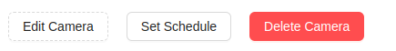
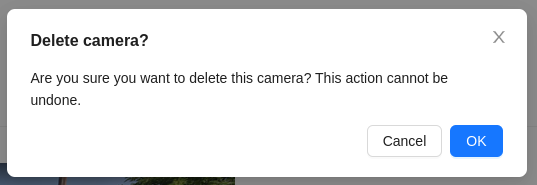

# Deleting a Camera
1. To delete a video camera, click the `Delete Camera` button on the camera's viewing page.

2. Then, confirm the deletion by clicking the `Ok` button:

:::warning Attention!
    It's not possible to delete a camera that has been shared with another user!
:::
