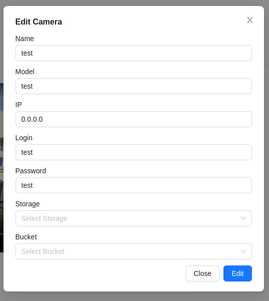

# Editing a Camera
1. To edit a video camera, click the `Edit Camera` button on the camera's viewing page.

2. Then, a form will appear with the camera's data:

3. After making the changes, click the `Edit` button to save them.
