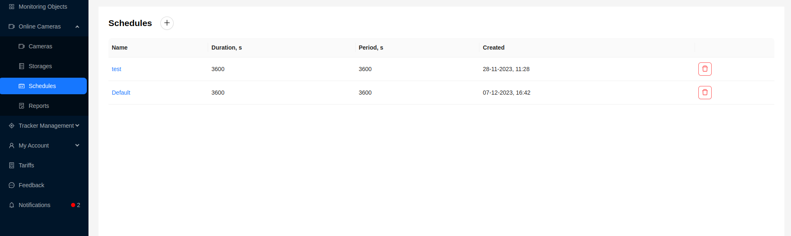
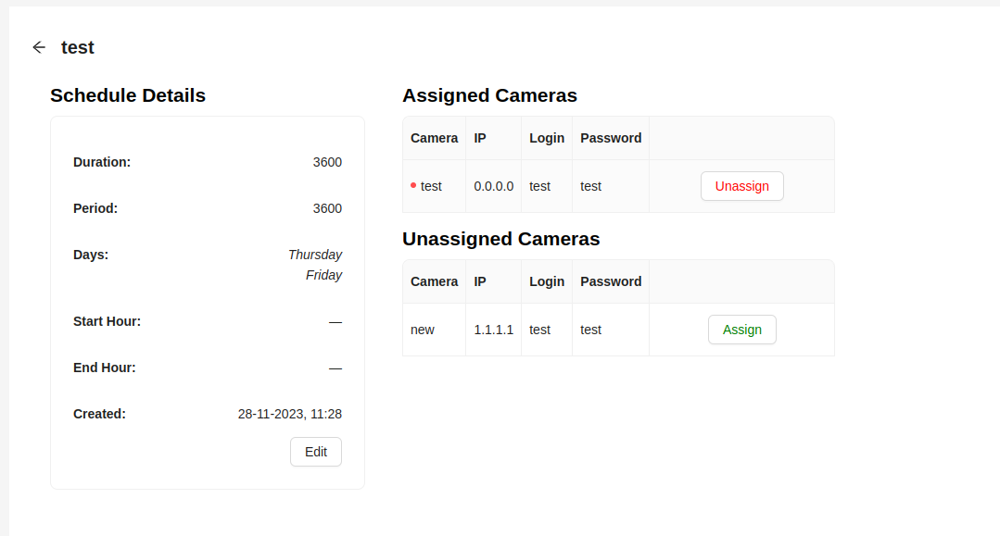
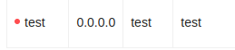
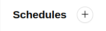
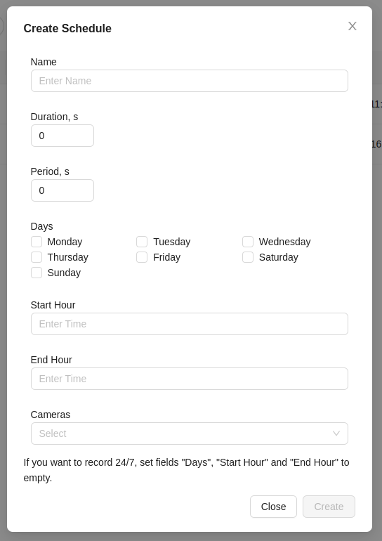
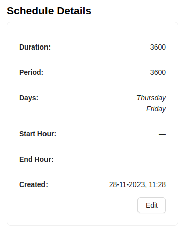
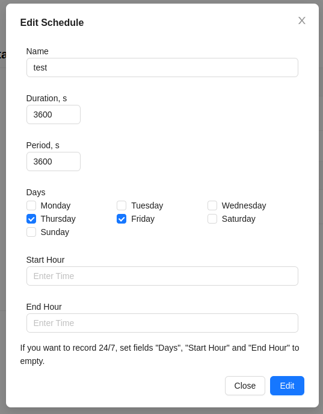
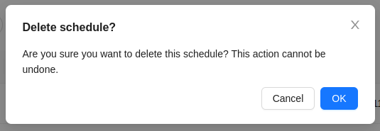

# Schedules

The system allows configuring schedules for video cameras.

## Interface

The main table displays the following data for schedules:
- Name
- Duration in seconds
- Period in seconds
- Creation date

## Detailed Information about Schedule

Clicking on the schedule name in the general list takes the user to the detailed camera information page.

In the **Schedule Details** block, detailed information about the schedule is displayed. To the right of it, there is information about the cameras in the form of two tables:
- **Assigned Cameras** - video cameras to which the current schedule is attached. Next to the camera name is an indicator in the form of a dot. A green dot indicates that the schedule is currently being used by the camera, while a red dot indicates that the schedule is attached to the camera but is not currently being used.

To detach the schedule, click the `Unassign` button.

- **Unassigned Cameras** - video cameras available for attaching to the current schedule. Attaching the schedule is done by clicking the `Assign` button.

## Creating a Schedule

1. To add a new schedule, click the button at the top of the **Schedules** page.

2. Fill out the form that appears:

- Name - the name of the schedule
- Duration, sec - the time interval in seconds during which the camera will not capture images.
- Period, sec - the time interval in seconds during which the camera will operate.
- Days - for selecting the days of the week on which the camera will operate.
- Start hour - the start time of the camera operation.
- End hour - the end time of the camera operation.
- Cameras - a dropdown list to select cameras that will operate according to the new schedule.

:::tip
Setting the ***Duration*** and ***Period*** fields to a value of 3600 will make the camera capture continuously.
:::
3. Click the `Create` button. If the data is entered correctly, the newly created schedule will appear in the list.

## Editing a Schedule

1. To edit a schedule, click the `Edit` button on its page.

2. The form with schedule data will appear.

3. After making changes, click the `Edit` button to save them.

## Deleting a Schedule

1. To delete a schedule, click the red trash icon button.

2. Confirm the deletion by clicking the `Ok` button:

