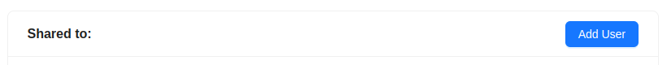
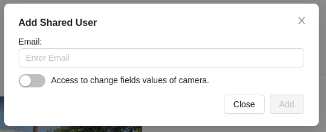
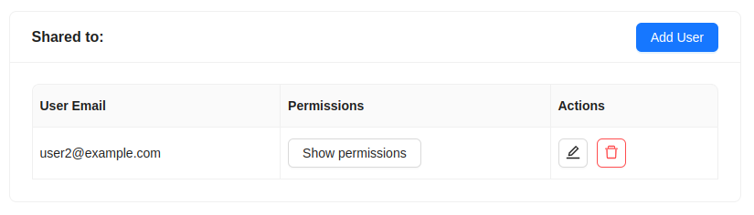
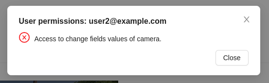
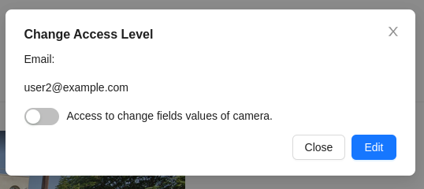
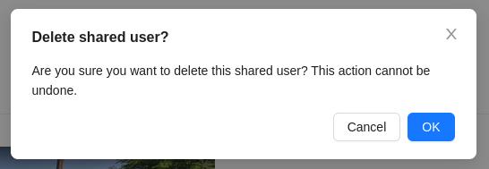
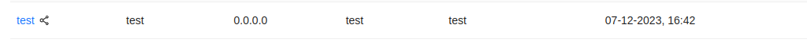

# Sharing a Camera

The system allows you to grant access to a video camera to other users (share a camera).

To share a camera with another user, go to the camera's viewing tab and click the `Add User` button.

Then, a window will appear where you need to enter the email of the user you want to share the camera with, as well as specify the permissions for this user.

After that, click the `Add` button.

Upon successful granting of access to another user, the camera owner will see information about the user who has been granted access.

Here, the camera owner can view the email of the user and perform some actions:

- View permissions for this user using the `Show Permissions` button.

- Edit permissions for the user.

- Delete the user from the list of those who have been granted access to the camera.

For the user who has been shared the camera, this camera will be displayed in the general list of cameras with a special icon.

:::warning Important
A user who has been granted access to the camera cannot share it with another user or delete this camera. Other functionality is available to them according to the permissions granted by the owner.
:::
