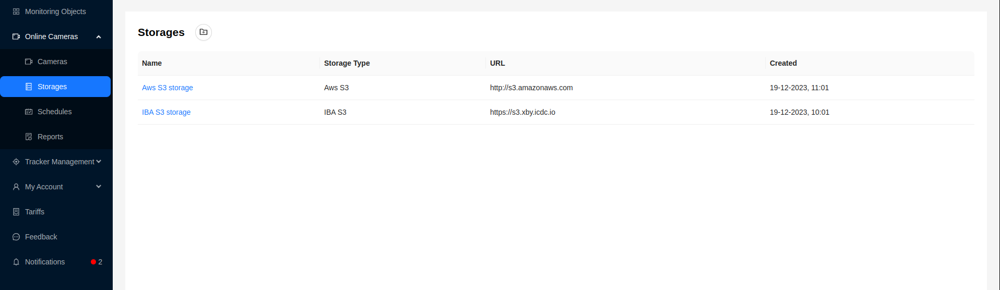
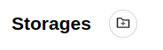
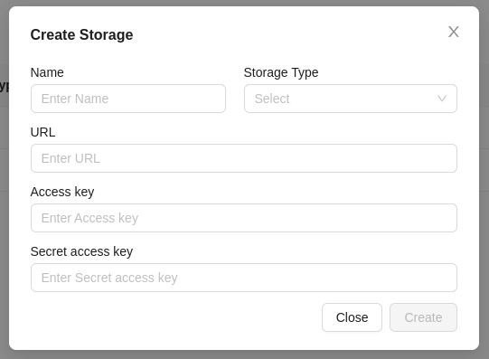
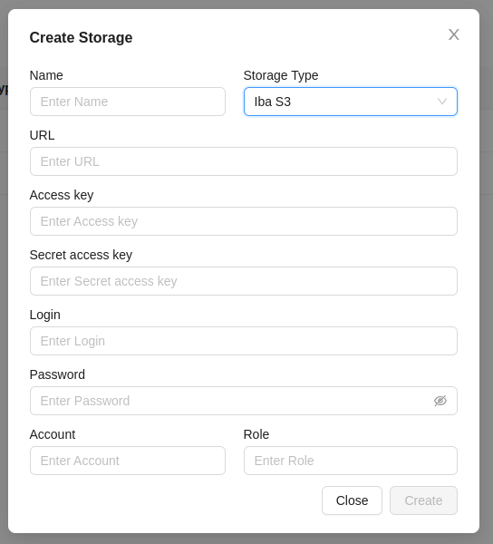
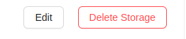
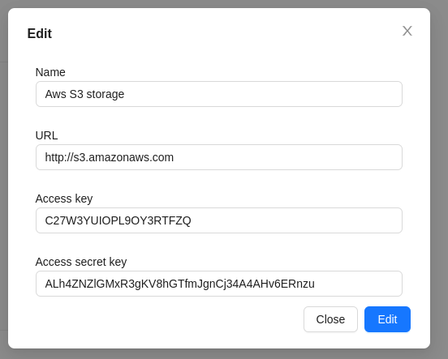
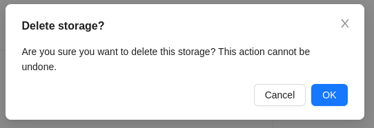

# Storages

The system provides the ability to use AWS S3 and ICDC S3 cloud storage systems for storing data from surveillance cameras.

## Interface

This page provides the user with information about the available storages in the form of a table with the ability to manage them.

The table provides the following information:
1. Storage name
2. Storage type. Learn more about types [here](cameras/storages#data-storage-support-iba-s3-and-aws-s3).
3. Storage URL.
4. Creation date.

## Detailed Storage Information

:::warning Attention
    This page is under development.
:::

## Adding a Storage

1. To add a new storage, click the button at the top of the **Storages** page.

2. Then, a form will appear, which you need to fill out:

- Name
- Storage type - [Aws S3 or Iba S3](cameras/storages#data-storage-support-iba-s3-and-aws-s3)
- URL
- Access key
- Secret access key

When choosing the **Iba S3** type, you need to fill in additional fields:
 
- Login
- Password
- Account name
- Role

3. Click the `Create` button. If the data is entered correctly, the created storage will appear in the list.

## Data Storage Support: IBA S3 and AWS S3

Our system provides users with the ability to choose between two types of data storage: IBA S3 and AWS S3. Both platforms offer extensive capabilities for storing and managing data, ensuring a high level of reliability, availability, and scalability.

- IBA S3 is a reliable and flexible data storage designed to meet the requirements of corporate clients. It provides a high degree of data protection, including encryption at rest and in transit, as well as access control mechanisms. IBA S3 also offers a flexible billing system and advanced administration capabilities.

- AWS S3 (Amazon Simple Storage Service) is a leading cloud storage platform provided by Amazon Web Services. It provides secure and scalable data storage with high availability and reliability. AWS S3 offers a wide range of tools for data management, including automation, monitoring, and analytics.

Choosing between IBA S3 and AWS S3:
Users can choose between IBA S3 and AWS S3 based on their preferences, data security requirements, budget, and other factors. Both platforms provide a high level of performance and functionality, allowing users to effectively manage their data according to their needs and business goals.

## Editing a Storage

1. To edit a storage, click the `Edit` button on its page.

2. Then, a form with storage data will appear.

3. After making changes, click the `Edit` button to save them. 

## Deleting a Storage

1. To delete a storage, click the `Delete Storage` button on its page.

2. Then, confirm the deletion by clicking the `Ok` button:

