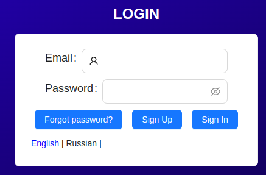
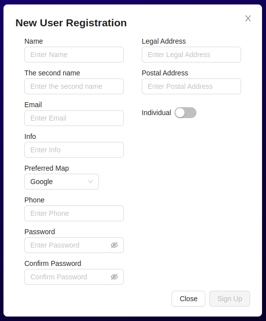
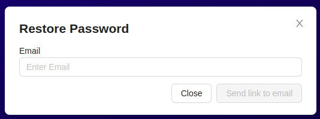
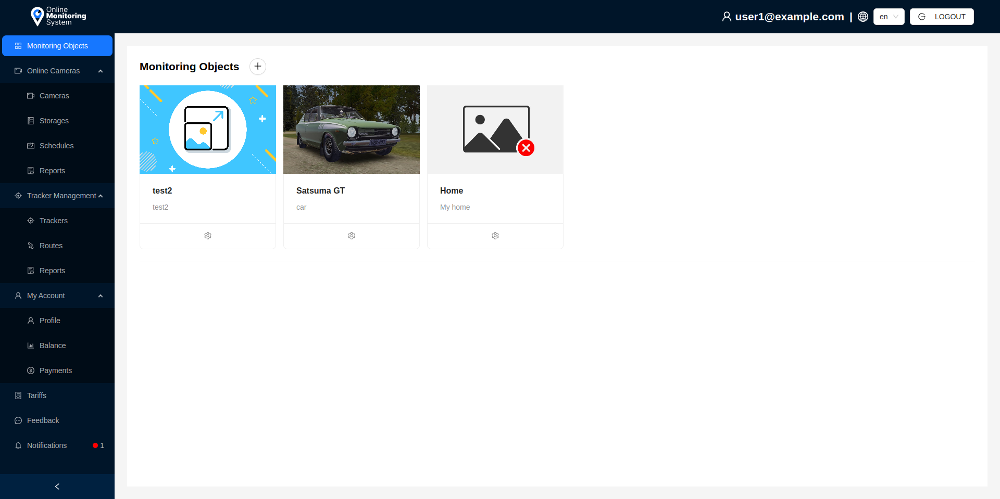

# Introduction

The platform **ZakodixOMS** is a comprehensive platform for video surveillance and satellite monitoring of vehicles. It includes functionality for object control and tracking, providing detailed information about the object both in real-time mode and historical data for specified periods.

## Authorization

To log into ZakodixOMS, the user needs to authenticate by filling in the fields `Email` and `Password`.

After filling in all the information, click the `Login` button.

### Registration

To register a new user in the system, click the `Sign Up` button and fill in the necessary fields in the opened form.

- The field `Preferred map` is required to select a provider of geographic maps.
- When changing the field `Individual` to `Legal entity`, additional fields necessary for filling in will appear.
- The password must be at least 8 characters long.

### Password Recovery

To recover the password, click the `Forgot password?` button. In the appeared window, write your email specified during registration.

After that, click the `Send link to email` button.

You will receive a link to reset your password by email, after clicking on which you will be able to specify a new password to log in.

## Platform Interface

The platform interface consists of several visual blocks:

- Side navigation panel:
1. `Monitoring objects` - transition to the list of user's monitoring objects.
2. `Online cameras` - category of functionality related to video surveillance and camera management.
3. `Cameras` - transition to the list of user's cameras.
4. `Storages` - transition to the list of user's storages.
5. `Schedules` - transition to the list of schedules for user's cameras.
6. `Reports` - transition to the page for generating reports on cameras.
7. `Tracker Management` - category of functionality related to object monitoring system and tracker management.
8. `Trackers` - transition to the list of user's trackers.
9. `Routes` - transition to the page for forming routes for user's trackers.
10. `Reports` - transition to the page for generating reports on trackers.
11. `My account` - category of functionality related to user account management.
12. `Profile` - transition to the profile editing form for the user.
13. `Balance` - transition to the list of user's operation history and balance viewing.
14. `Payments` - transition to the page for tariff payments for trackers/cameras.
15. `Tariffs` - transition to the list of user's tariffs.
16. `Feedback` - transition to the feedback form.
17. `Notifications` - transition to the list of user's notifications.

- Top information panel:
1. Information(email) of the current user.
2. Dropdown menu for selecting the current platform language.
3. `Logout` button to log out and return to the login page.

- Main window for working with the platform.

:::tip Administrator

The elements of the navigation and information panels may differ for a user with Administrator rights. See more details in section **Administrator**.

:::
