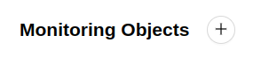
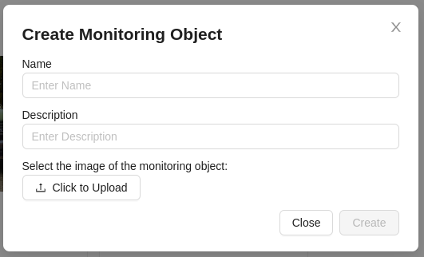

# Adding a Monitoring Object

1. To add a new monitoring object, you need to click on the button at the top of the **Monitoring Objects** main page.

2. After that, a form will appear, which needs to be filled out:

- Name - the name of the monitoring object for user identification.
- Description - a more detailed description of the monitoring object.
- Button to upload an image identifying the monitoring object.

3. Click the `Create` button. If the data is entered correctly, a new monitoring object will appear on the page.
