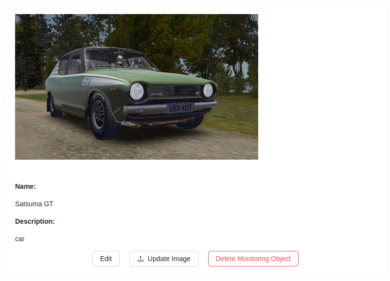
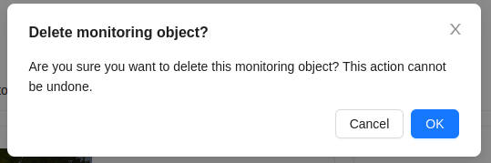

# Deleting a Monitoring Object
1. To delete a monitoring object, you need to click on the `Delete Monitoring Object` button on the object's page.

2. Then confirm the deletion by clicking the `Delete` button:

:::warning Attention!
    It's not possible to delete a monitoring object shared by another user!
:::
