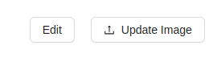
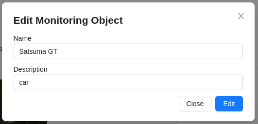

# Editing a Monitoring Object
To edit a monitoring object, there are 2 buttons on its page:

1. Clicking the `Edit` button will bring up the editing form for the monitoring object, with the ability to change its name and description. To save the changes in the form, click the `Edit` button.

2. The `Update Image` button is used to update the monitoring object's image by uploading a new one.

:::warning Attention!
The size of uploaded images should not exceed 3MB.
:::
