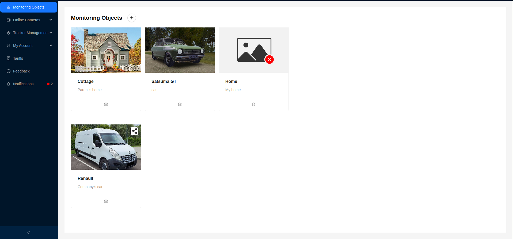

# Monitoring Objects

A **monitoring object** is a physical entity equipped with specialized devices, such as GPS trackers and cameras, that allow real-time monitoring or subsequent analysis. A monitoring object can include various types of vehicles (e.g., cars, trucks, ships), equipment (e.g., industrial machinery, containers), or other objects requiring constant observation and control to ensure safety, efficiency, and process optimization.

## Interface

The interface consists of a list displayed as cards. Each element represents a monitoring object, displaying an image, name, and brief description. Monitoring objects shared by other users are marked with a special icon and are located below the user's own monitoring objects. More information about sharing a monitoring object can be found in the [corresponding section](/monObjects/sharing).

When clicking on a monitoring object, the user can view detailed information.

## Detailed Information about the Monitoring Object

The monitoring object's detailed information window contains several tabs:
1. Monitoring Object Details
2. Cameras of the Monitoring Object
3. Trackers of the Monitoring Object
4. Routes of the Monitoring Object

In the monitoring object details, the page is visually divided into 2 blocks - a block with basic information about the object and a block for [granting access](/monObjects/sharing) to the object to other users.

The user can see the image of the monitoring object, its name, brief description, and a button panel to [edit](/monObjects/editMonObject) or [delete](/monObjects/deleteMonObject) the monitoring object.

## Cameras of the Monitoring Object

This tab contains a list of cameras attached to the current monitoring object.

The following information is provided for each camera:
1. Camera name - clicking on it will navigate to the [detailed information about the camera](/cameras).
2. Camera model
3. Camera IP address
4. Login
5. Password
6. Camera creation date
7. "Unassign Camera" button, which allows the user to unlink the camera from the current monitoring object, removing it from the list of cameras.

Additionally, by clicking the "Create Camera" button, the user can [create a new camera](/cameras#создание).

If the user needs to link an existing camera to the monitoring object, they can click the "Link Camera" button and select a camera from the available ones in the dropdown list.

:::tip
If there are no available cameras, the user will see a corresponding message.
:::

## Trackers of the Monitoring Object

This tab contains a list of trackers attached to the current monitoring object.

If the user needs to link an existing tracker to the monitoring object, they can click the `Asign Tracker` button and select a tracker from the available ones in the dropdown list. Similarly, there is an option to unlink a tracker using the corresponding `Unassign Tracker` button.

The remaining functionality is **similar** to the functionality on the trackers page. More details can be found in the [corresponding section](/trackers/intro).

## Routes of the Monitoring Object

This tab provides the ability to view detailed data on the movement of trackers of the monitoring object over various periods and to plot routes of movement for each tracker of the monitoring object for the specified period, simultaneously displaying them on the map.

This functionality is **similar** to the functionality on the routes page, except that routes can only be plotted for trackers of the monitoring object, not for all trackers owned by the user. More details can be found in the [corresponding section](/trackers/routes).
