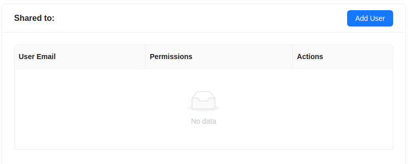
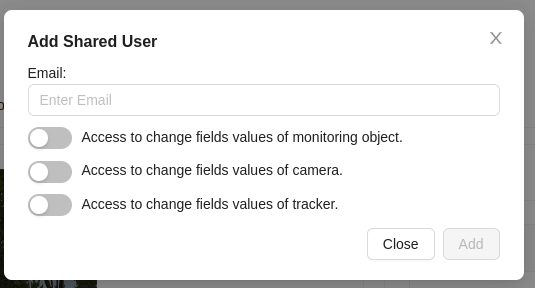
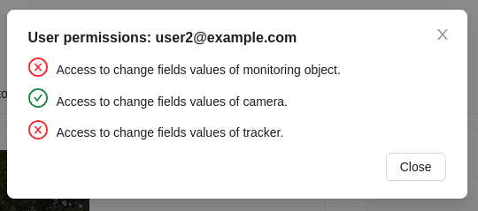
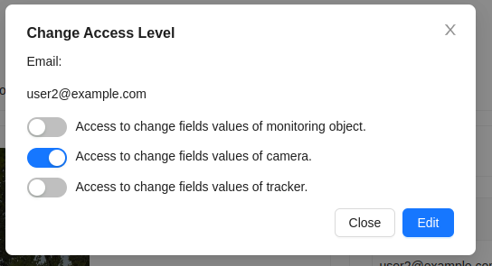
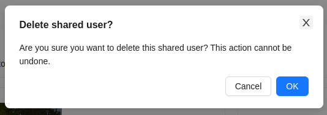
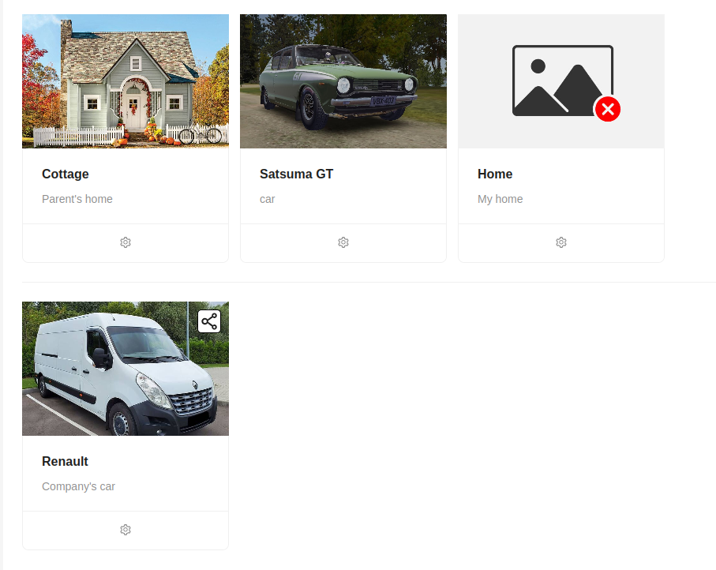

# Sharing a Monitoring Object

The system allows users to grant access to a monitoring object to other users (share a monitoring object).

When granting access rights to a monitoring object to another user, they are provided access to the cameras and trackers included in this monitoring object.

This functionality is located on the detailed page of the monitoring object, on its right side.

To share a monitoring object with another user, click on the `Add User` button.

Then a window will appear where you need to enter the email of the user you want to share the object with, as well as specify permissions for this user.

After that, click the `Add` button.

Upon successfully granting access to another user, the owner will see information about the user to whom access has been granted in the detailed information window of the monitoring object.

Here the owner can view the user's email and perform some actions:

- View permissions for this user using the `Show Permissions` button

- Edit permissions for the user

- Delete the user from the list of those who have been granted access to the object.

For the user with whom the monitoring object has been shared, this object will be displayed in the general list of monitoring objects with a special icon. The trackers and cameras included in this monitoring object are also marked with this icon in the corresponding sections.

:::warning Important
A user who has been granted access to a monitoring object cannot share it with another user or delete this object. Other functionalities are available to them according to the permissions granted by the owner.
:::
