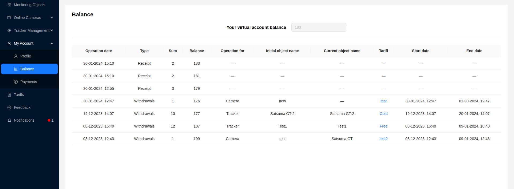

# Balance

The **Balance** page allows you to view your virtual balance and the history of all transactions.

The user may be provided with the following data:
- `Operation Date` - the date of the operation
- `Type` - balance replenishment or tariff payment
- `Sum` - the amount of the operation
- `Balance` - the balance value after the operation
- `Operation For`* - indicates for which device the payment was made, for a camera or a tracker.
- `Initial object name`* - the name of the device at the time of the operation.
- `Current object name`* - the current name of the device.
- `Tariff`* - the tariff for which the payment was made
- `Start Date`* - the start date of the paid tariff
- `End Date`* - the end date of the paid tariff

*For the **Receipt** type of operation, this value is **—**.

:::tip
By clicking on the paid tariff, the user can navigate to the [tariffs page](/tariffs).
:::
