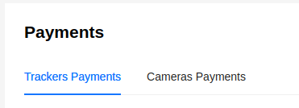
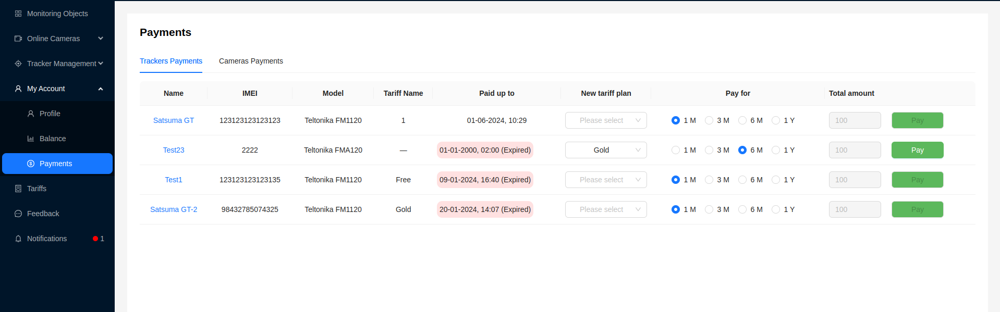
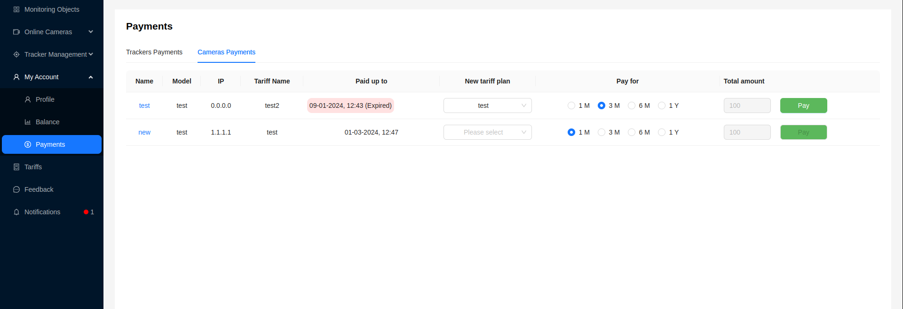

# Payments

Here, the user can make payments for trackers and cameras based on the [tariffs](/tariffs) available to them.

The page has 2 tabs - Tracker Payments and Camera Payments, for paying tariffs for the corresponding devices.

## Tracker Payments

The user is provided with the following information:
- `Name` - the name of the device. Clicking on it opens a window with [detailed information about the tracker](/trackers/intro#tracker-information).
- `IMEI` - IMEI number of the tracker
- `Model` - tracker model
- `Tariff Name` - the name of the previous/current tariff
- `Paid up to` - the paid period of the tariff. If the tariff has expired, this field is highlighted in red with the note ***(Expired)***
- `New tariff plan` - a dropdown list with available tariffs for the user to choose from
- `Period` - checkboxes for the user to select the duration of the paid tariff.

Available periods:
1. 1 month
2. 3 months
3. 6 months
4. 12 months (1 year)
- `Total Amount` - the total amount to be paid based on the parameters selected by the user
- `Pay` Button - available only when the user selects all parameters

## Camera Payments

The user is provided with the following information:
- `Name` - the name of the device. Clicking on it opens a window with [detailed information about the camera](/cameras/intro).
- `Model` - camera model
- `IP` - device IP address
- `Tariff Name` - the name of the previous/current tariff
- `Paid up to` - the paid period of the tariff. If the tariff has expired, this field is highlighted in red with the note ***(Expired)***
- `New Tariff plan` - a dropdown list with available tariffs for the user to choose from
- `Period` - checkboxes for the user to select the duration of the paid tariff.

Available periods:
1. 1 month
2. 3 months
3. 6 months
4. 12 months (1 year)
- `Total Amount` - the total amount to be paid based on the parameters selected by the user
- `Pay` Button - available only when the user selects all parameters

## Tariff Payment

The payment mechanism for cameras and trackers is the same:
1. Select a new tariff for the device from the dropdown list in the `New tariff plan` column.
2. Choose the period for which the user pays the tariff in the `Pay For` column.
3. The total cost will be calculated and displayed in the `Total Amount` column.
4. Click the `Pay` button.

The user can view the history of transactions on the [Balance](/myAccount/balance) page.
