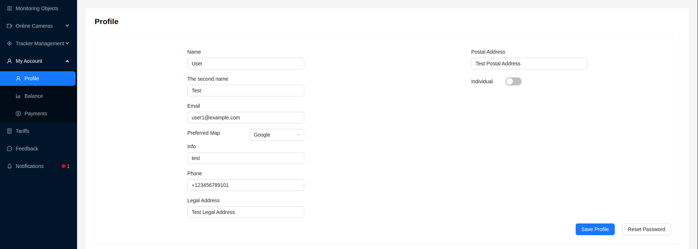
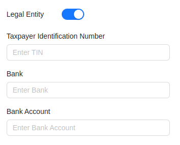

# Profile

The profile page is designed for changing user profile information and contains some settings.

The user can edit the following information:

- First Name
- Last Name
- Email
- Configure the preferred [map](/en/trackers/map), which will be used to display maps in the [monitoring system](/category/trackers)
- Additional information about the user
- Phone number
- Postal address
- Specify the user type (individual/legal entity). When selecting the **Legal entity** type, additional fields for entering data will appear.

After editing the necessary fields, the user needs to click the `Save Profile` button.

Using the `Reset Password` button, the user can reset their password to access the system. When clicked, an email will be sent to the specified email address with instructions on how to reset the password.
