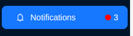
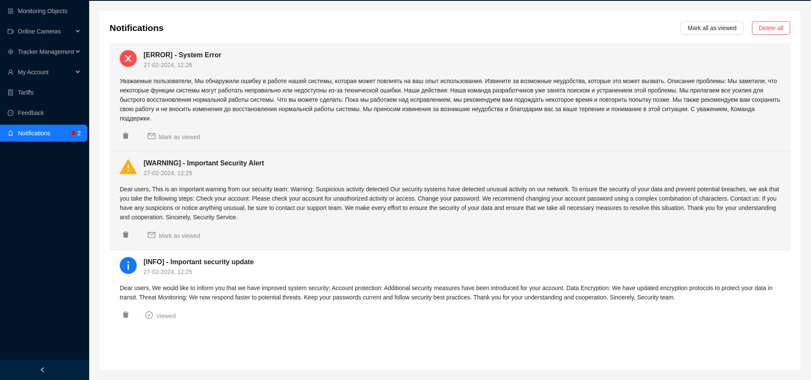
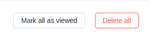

# Notifications

When new notifications are received, the sidebar will display the total number of unread notifications, indicated by a red indicator.

The **Notifications** page is designed to display and view notifications from the system, which may be important for users. Notifications may include information about new features, updates, errors, or other events requiring users' attention. Unread (active) notifications are displayed on a darker background.

Each notification provides the user with the following information:
1. Notification type in the form of an image (information, error, warning)
2. Title
3. Date of notification creation
4. Main text with information

Upon receiving and viewing a notification, the user needs to click the `Mark as Read` button to remove it from the active list. The notification status will then change to **Read**.

By clicking the trash can icon, the user can delete the notification from the list.

Additional notification management buttons are located in the top right corner:

1. `Mark All as Read` - mark all existing notifications as read and remove them from the active list.
2. `Delete All` - delete all existing notifications.

:::tip
Only an [**Administrator**](/category/admin) can manage the creation and sending of notifications.
:::
