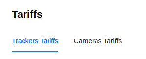
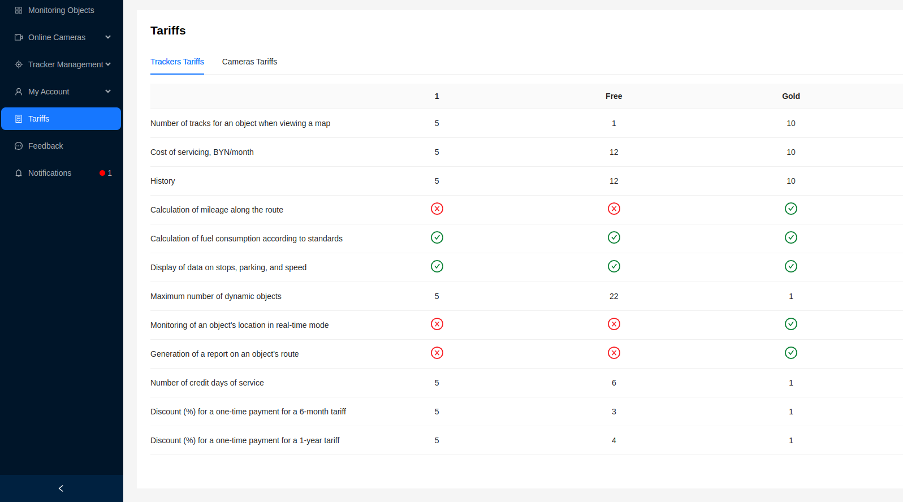
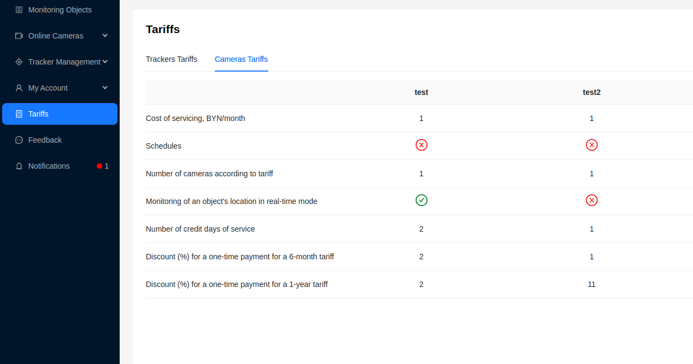

# Tariffs

On the "Tariffs" page, users can familiarize themselves with the available tariffs for cameras and trackers. The page contains two tabs: "Camera Tariffs" and "Tracker Tariffs".

Each tab provides information about the available tariffs. Tariffs are set by the [**Administrator**](/category/admin).

- Interface of the **Tracker Tariffs** tab

- Interface of the **Camera Tariffs** tab

