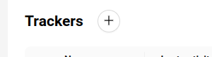
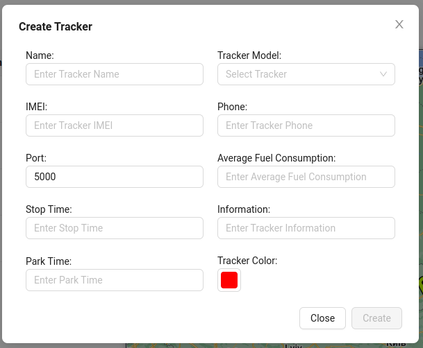

# Adding a Tracker
1. To add a new GPS tracker, you need to click on the button at the top of the **Trackers** page.

2. Then a form will appear that needs to be filled out:

- Name - the name of the tracker to identify it by the user.
- Tracker Model - the model of the tracker used, selected from those supported by the platform. Supported models can be determined by the **Administrator**.
- IMEI - the IMEI number of the GPS device (tracker).
- Phone - phone number, if the GPS device has a SIM card.
- Average Fuel Consumption - the average fuel consumption for trackers installed on cars and other vehicles.
- Stop Time - the number of seconds after which, if the object has stopped moving, it switches to stop mode.
- Park Time - the number of seconds after which, if the object has stopped moving, it switches to parking mode.
- Information - additional information about the tracker, necessary for the user.
- Tracker color - the color used to indicate routes and the marker of the created tracker on the map.

3. Click the `Create` button. If the data is entered correctly, the created tracker will appear in the list.
