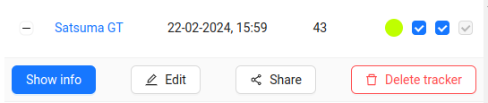
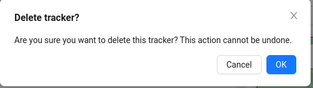

# Deleting a Tracker
1. To delete a GPS tracker, you need to click on the `Delete tracker` button next to the desired tracker on the **Trackers** page.

2. Then confirm the deletion by clicking the `Ok` button:

:::warning Warning!
You cannot delete a tracker shared by another user!
:::