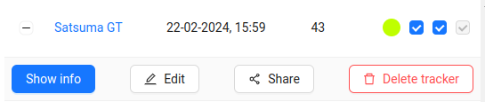

# Editing a Tracker
1. To edit a GPS tracker, you need to click on the `Edit` button next to the desired tracker on the **Trackers** page.

2. Then a form with the tracker's data will appear:

3. After making changes, click the `Edit` button to save them.
