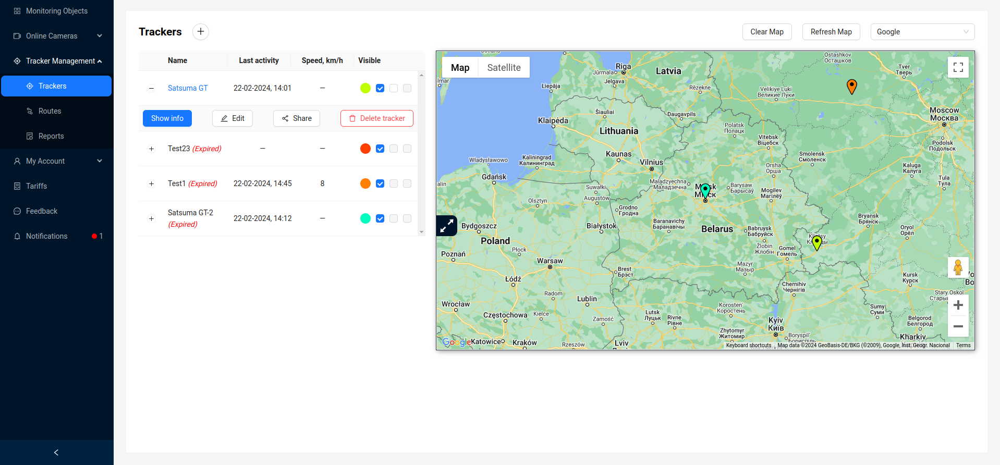
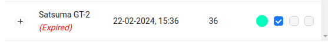
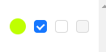
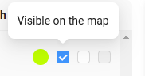
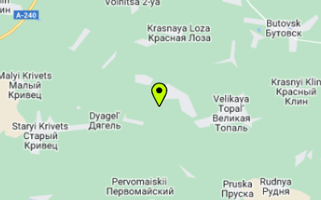
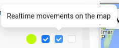
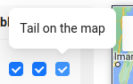
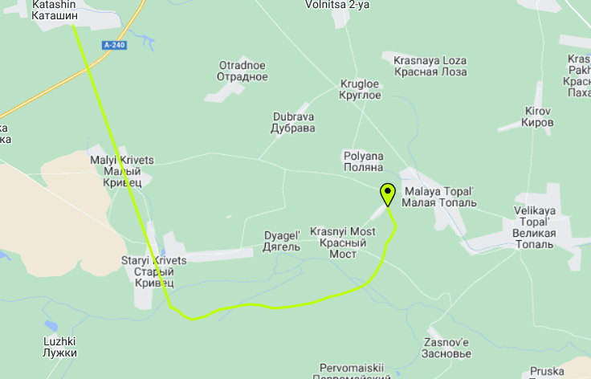

# Trackers

**GPS tracker** (also GPS controller, tracker) is a device for receiving and transmitting data for satellite monitoring of vehicles, people, or other objects to which it is attached, using GPS to accurately determine the location of the object.

The system is designed to monitor monitoring objects, provide detailed information about objects in real-time mode and in historical data mode for specified periods, and display information about objects on the map.

## Interface

The interface of the `Trackers` tab consists of two visually separated blocks located side by side - these are the list of user trackers and the [map](/trackers/map) on which active trackers are displayed with markers.

The user can see information about the observation object in real-time: name, date and time of the last communication of the monitoring object with the server, current location, speed of movement of the monitoring object at its last communication with the server, stop time, user-defined parking time, general information about the tracker of the object, color of the marker of the monitoring object when it is displayed on the map.

## Tracker Information

In the tracker table, the user can see the tracker name, date of last activity, current speed.

More detailed information is available by clicking the `Show Info` button.

Here is detailed information about the GPS tracker, as well as information about the users with whom the owner shared this tracker. More about the **Share Tracker** functionality can be found in the corresponding [section](/trackers/sharing).

:::tip Help

If the paid tariff time for the GPS tracker has expired, the tracker is marked as `Expired`.

:::

## Map Display Management

Also in the tracker table, each tracker has some settings for displaying the tracker on the map. They consist of 3 checkboxes:

:::warning Checkbox activation order

When the `Visible on map` checkbox is unchecked, the other checkboxes will be disabled. When the `Realtime movement on the map` checkbox is unchecked, it is impossible to enable the `Tail on the map` checkbox. Also, if the tariff for the current tracker is unpaid, all checkboxes except `Visible on map` will be disabled.

:::
- The `Visible on map` checkbox allows you to toggle the display of the tracker marker on the map. With the checkbox enabled, the user can observe the tracker marker on the map, highlighted in the corresponding color:

       

- The `Realtime movement on the map` checkbox allows tracking the movement of the tracker marker on the map in real-time.

- The `Tail on the map` checkbox allows tracking the route of the tracker on the map.

      

Thus, through these 3 checkboxes, the user can manage the display of markers on the map.

### Additional map functionality
Above the map are some control elements:

- `Clear map` - clears the map of all routes and markers.
- `Refresh map` - Allows you to refresh the positions of all markers manually.
- Dropdown list for changing map providers. More information about supported providers can be found in the [Map](/trackers/map) section.
