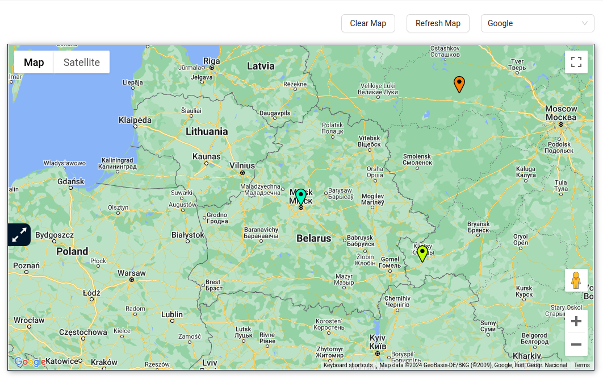
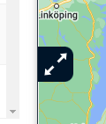

# Map
The map block in the system is designed to track the location of trackers, their movements, and display routes.

The system supports the following maps:

- Google Maps;
- Yandex Maps;
- OpenStreetMap.

You can change the map provider in the top right corner using the dropdown list, or on the **Profile** editing page.

There is also a button on the left side of the map that, when clicked, allows the user to expand the map block.

### Markers

Markers show the current location of GPS trackers on the map.

