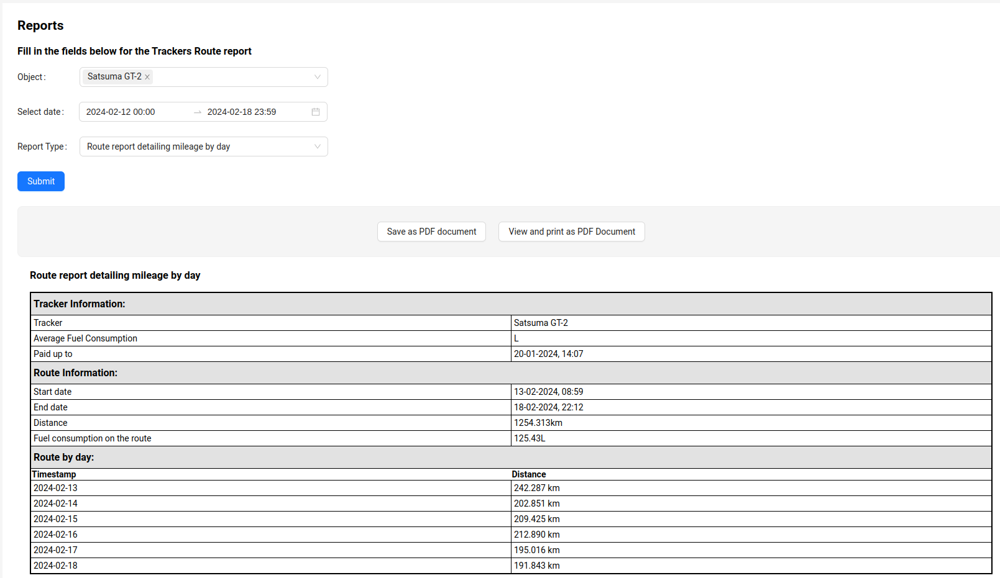
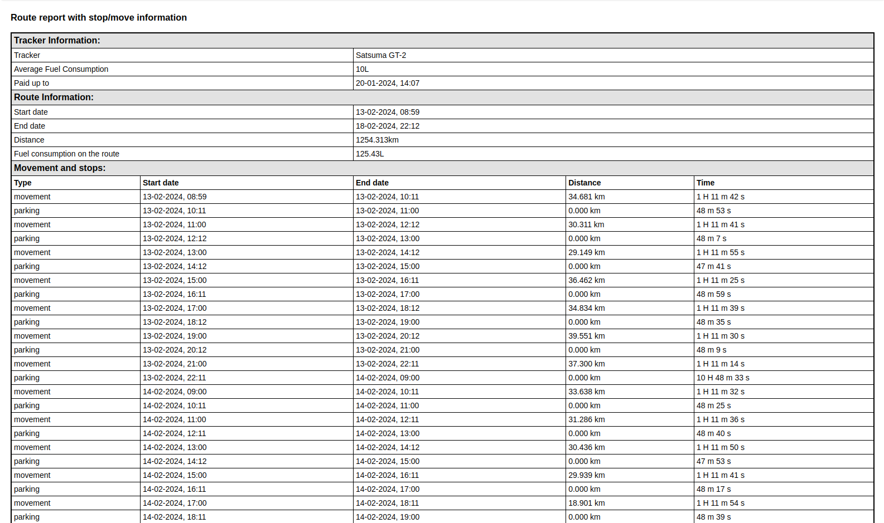

# Tracker Reports

The system provides the ability to view detailed data on tracker movement over various periods of time and to generate movement routes for the specified period for each tracker, simultaneously displaying them on the map.

To view reports, fill out the form on the **Reports** page.

1. Specify which trackers the report is needed for. The user can select multiple trackers using the multiple selection option in the dropdown menu.
2. Specify the period for which the report is needed.
3. Select the type of report.

The following types of reports are available in the system:
1. Route report short;
2. Detailed route report with mileage breakdown by days;
3. Route report with information on stops/movements;
4. Detailed route report with mileage breakdown by days and information on stops/movements.

:::tip
The user can view the report on the page and also download it as a PDF or view it as a PDF by clicking the corresponding button. Also, from the PDF view mode, the report can be printed directly.
:::

## Route report short

The route report short provides general information such as:
- Average fuel consumption of the vehicle with the tracker installed.
- Date until which the tracker is paid for by the tariff.
- Start date of the route.
- End date of the route.
- Distance of the route (mileage).
- Fuel consumption on the route.

When selecting multiple trackers, the report will contain information about each specified tracker.

## Route report detailing mileage by day

The route report detailing mileage by day provides general information such as:
- Average fuel consumption of the vehicle with the tracker installed.
- Date until which the tracker is paid for by the tariff.
- Start date of the route.
- End date of the route.
- Distance of the route (mileage).
- Fuel consumption on the route.
- Distance of the route (mileage) for each complete day within the specified period.

When selecting multiple trackers, the report will contain information about each specified tracker.

## Route report with stop/move information

The route report with stop/move information provides general information such as:
- Average fuel consumption of the vehicle with the tracker installed.
- Date until which the tracker is paid for by the tariff.
- Start date of the route.
- End date of the route.
- Distance of the route (mileage).
- Fuel consumption on the route.
- Information on movements and stops:
    - Type
    - Start and end date/time of movement/stop
    - Distance (mileage)
    - Duration of movement/stop

When selecting multiple trackers, the report will contain information about each specified tracker.

## Route report detailing mileage by day and information on stops/movements

The route report detailing mileage by day and information on stops/movements provides general information such as:

- Average fuel consumption of the vehicle with the tracker installed.
- Date until which the tracker is paid for by the tariff.
- Start date of the route.
- End date of the route.
- Distance of the route (mileage).
- Fuel consumption on the route.
- Distance of the route (mileage) for each complete day within the specified period.
- Information on movements and stops:
    - Type
    - Start and end date/time of movement/stop
    - Distance (mileage)
    - Duration of movement/stop

When selecting multiple trackers, the report will contain information about each specified tracker.
