# Routes
The system provides the ability to view detailed data on the movement of a tracker over different periods of time and to plot routes of movement for the specified period for each tracker, simultaneously displaying them on the map.

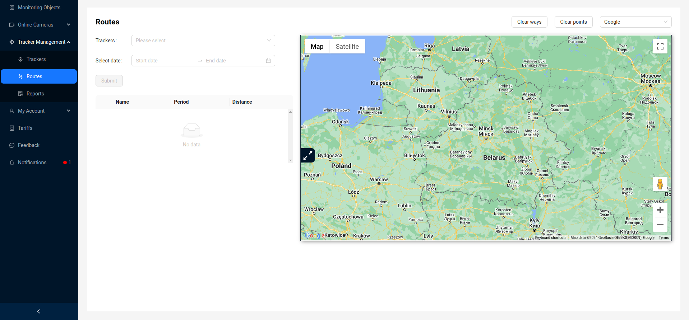

## Route Creation
To create routes of movement for a specific period of time, the user needs to select trackers from the available ones and specify the time period. Trackers are selected from a dropdown list. At the same time, the user can create routes of movement for multiple trackers by selecting them simultaneously.

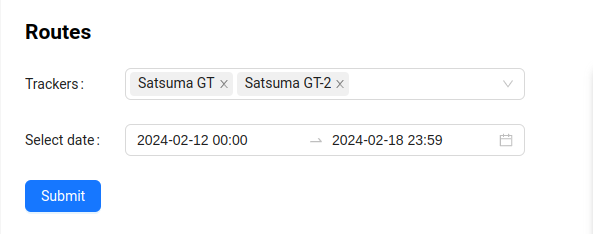

Then the user needs to click the `Submit` button.

If the system has data on the movements of the specified trackers for the specified period, the user will be provided with information about the trackers, the period for which movement data is found, as well as information about the total distance covered by the tracker for the time period.

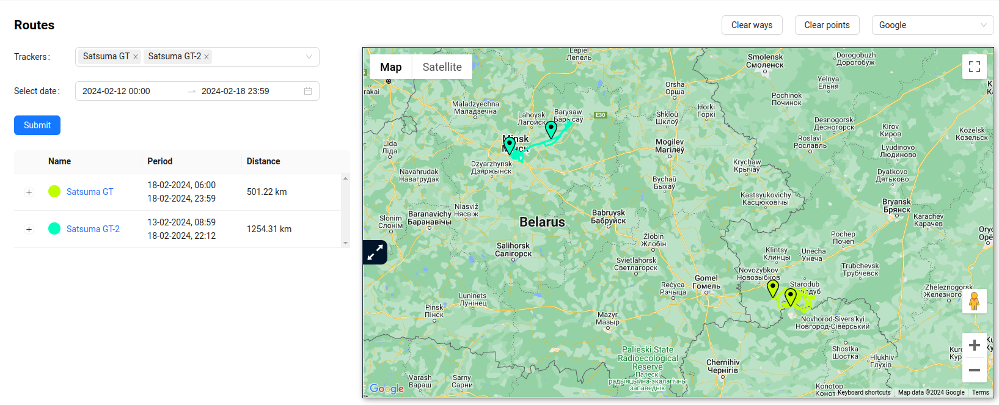

Also, routes will be plotted on the map, highlighted with corresponding colors, for the specified period. Each route by default contains 2 markers - the start marker and the finish marker, clicking on which, the user will see the address of the tracker's location at that point.
- start address:

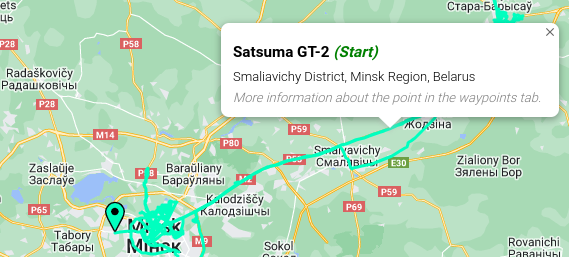
- finish address:

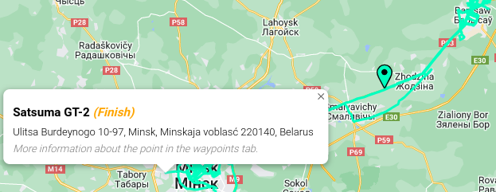

## Detailed Route Information

To view detailed information about a route, there are 3 buttons in the route table:
1. `Movements and Stops`
2. `Graphs`
3. `Waypoints`

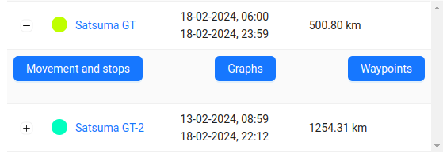

Clicking on them will display a new block with information below the map.
It has 3 tabs, each of which duplicates the buttons in the route table.

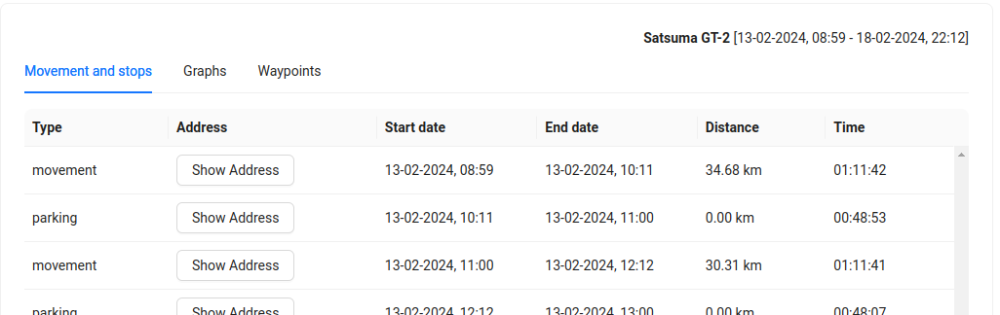

At the top right, the tracker name and the time period for which the information is provided are indicated.

From any view of the information, you can go to the map.

### Movements and Stops

A table with detailed data on stops/movements, displaying information broken down by parameters: stop, parking, and movement. For each parameter, the address, start and end time of the action, total distance (mileage), and total time spent are indicated.

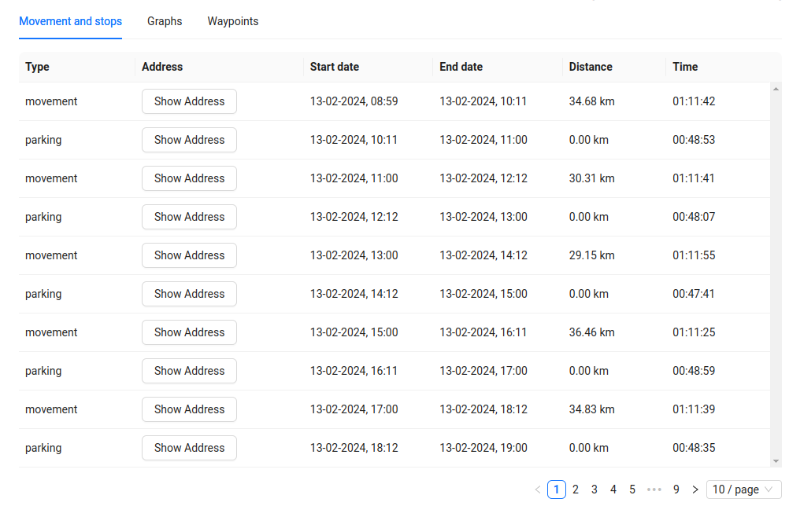

By clicking the `Show Address` button, an additional marker will appear on the map (2 markers for the ***movement*** type), and the address will be displayed in the table:
- For stop and parking - the address of the stop/parking point.
- For movement - the addresses of the start and end of movement.

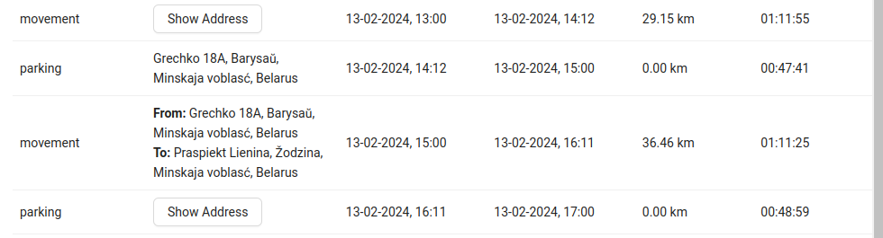

:::tip
The table **Movements and Stops** has pagination for navigation, with the ability to navigate through pages and select the number of rows per page.
:::

### Graphs

The user has access to view 2 types of graphs:
- Speed Graph
- Satellites Graph

The **Speed Graph** displays speed and time data.

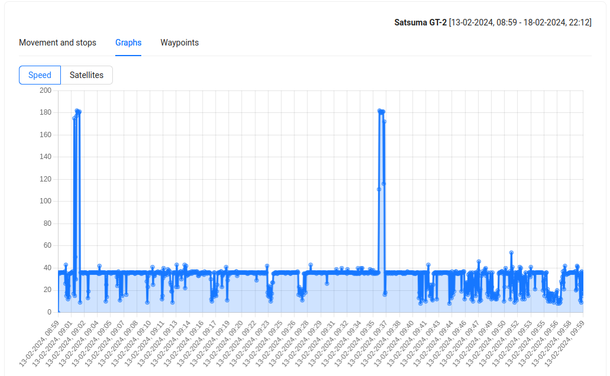

By clicking the mouse on a point on the speed graph, a marker with information about the location, GSM signal level, number of satellites, and speed will be added to the map.

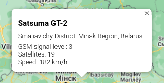

Hovering over a point on the speed graph will display a popup window with the speed value at that point.

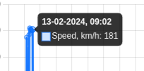

The **Satellites Graph** displays information about the number of satellites and time.

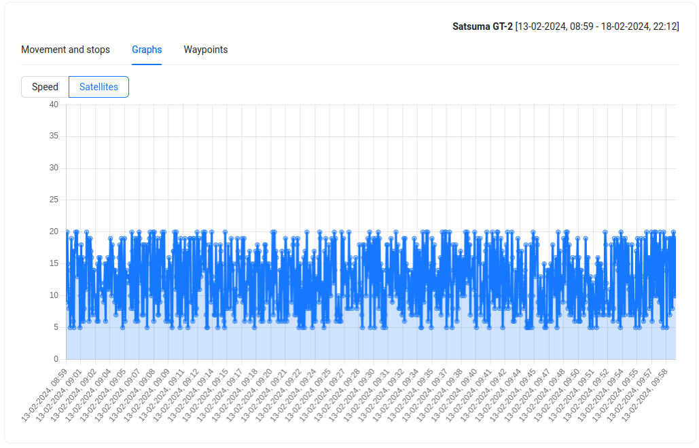

Hovering over a point on the satellites graph will display a popup window with the number of satellites at that point.

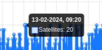

:::tip
Navigation through the graph is done with the mouse. You can zoom in or out of the graphs by rotating the mouse wheel. When the mouse pointer is on the graph, if you hold down the left button, you can move left/right along the graph.
:::

### Waypoints

A table with detailed data for each waypoint, displaying information about the date of fixing the point by the GPS device, the address of the location, the speed at the time of data transmission to the server, the number of satellites, and the GSM signal level.

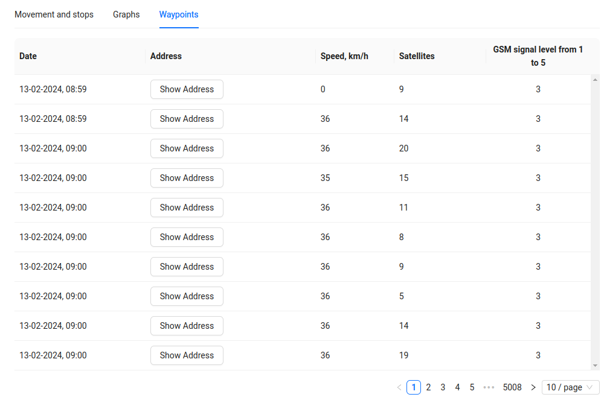

By clicking the `Show address` button, an additional marker will appear on the map, and instead of the button, the address of the waypoint location will be displayed in the table.

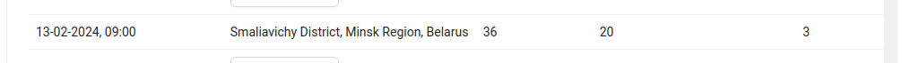

:::tip
The table **Waypoints** has pagination for navigation, with the ability to navigate through pages and select the number of rows per page.
:::

## Additional Map Functionality
Above the map are some control elements:

- `Clear ways` - clears the map of all route markers.
- `Clear points` - clears the map of all markers.
- Dropdown list for changing map providers. More information about supported providers can be found in the [Map](/trackers/map) section.
