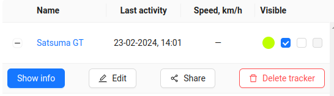
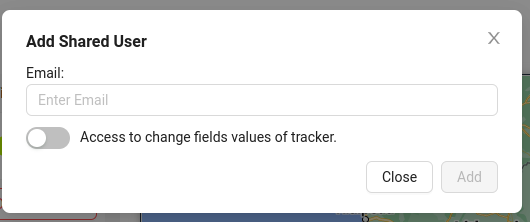
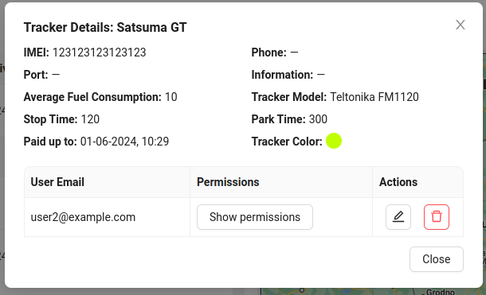
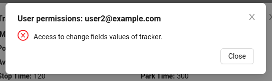
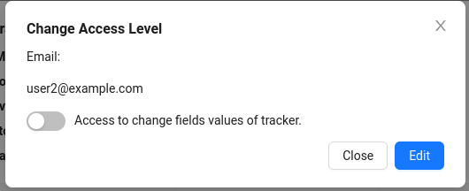
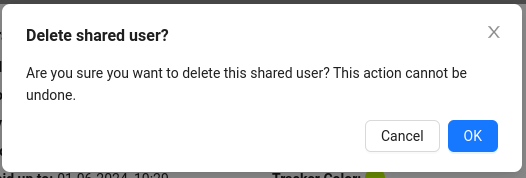
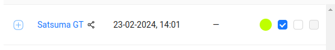

# Share Tracker

The system allows you to grant access to a tracker to other users (share a tracker).

To share a tracker with another user, click the `Share` button.

After that, a window will appear where you need to enter the email of the user you want to share the tracker with, as well as specify the permissions for this user.

Then click the `Add` button.

Upon successfully granting access to another user, the tracker owner will see information about the user to whom access has been granted in the detailed tracker information window (which opens when clicking the `Information` button).

Here, the tracker owner can view the user's email and perform some actions:

- view the permissions of this user using the `Show permissions` button.

- edit the permissions of the user.

- remove the user from the list of those who have access to the tracker.

For the user with whom the tracker was shared, this tracker will be displayed in the general list of trackers with a special icon .

:::warning Important
The user to whom access to the tracker has been granted cannot share it with another user or delete this tracker. Other functionality is available to them according to the permissions granted by the owner.
:::
