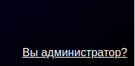
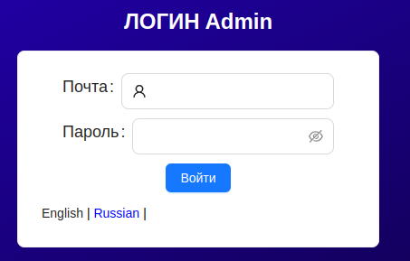
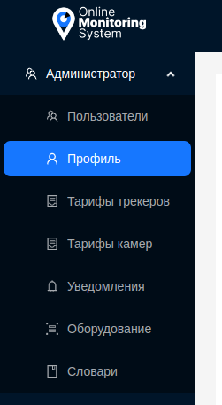

#  Администратор

**Администратор** в системе обладает полными правами и ответственностью за управление всеми аспектами её функционирования. Он имеет привилегии управления пользователями, настройками тарифов, конфигурацией оборудования, а также создания и рассылки уведомлений. Кроме того, администратор обеспечивает контроль над доступными пользователям языками интерфейса системы, обеспечивая удобство использования для всех участников. 

## Авторизация

Администратор имеет отдельную страницу входа в систему. Попасть на неё можно с основной страницы авторизации, по ссылку в нижнем правом углу.

После перехода по ней, администратору необходимо ввести данные для входа и нажать кнопку `Войти`.

## Возможности

Администратор имеет боковое меню, отличное от пользовательского:

- Пользователи - Управление пользователями.
- Профиль - Редактирование профиля администратора.
- Тарифы трекеров - Управление тарифами трекеров.
- Тарифы камер - Управление тарифами камер.
- Уведомления - Управление уведомлениями.
- Оборудование - Управление оборудованием.
- Словари - Управление языковыми словарями.

Более подробная информация описана в соответствующих разделах.