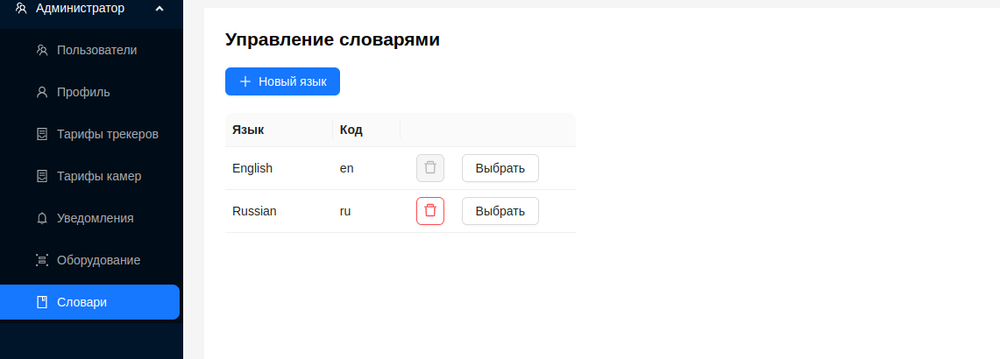
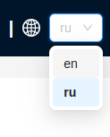
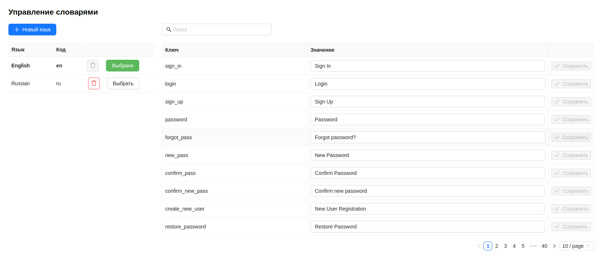
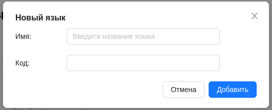
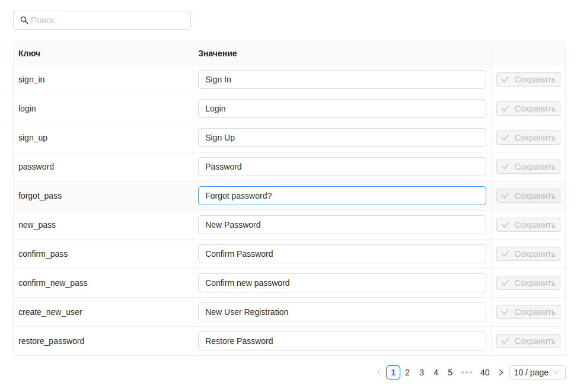
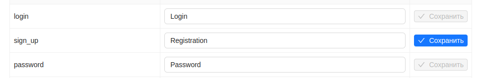
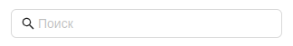

#  Словари

Администратор может управлять языковыми словарями в системе, доступными пользователям, добавлять новые или изменять существующие.

 

При использовании платформы, пользователям доступен выбор нужного языкового словаря на странице входа, а так же в верхней панели.

 

Для просмотра языкового словаря, Администратору необходимо нажать на кнопку `Выбрать`, после чего откроется дополнительное окно со словарем.

 

## Добавление нового словаря

1. Для добавления нового словаря необходимо нажать на кнопку `+ Новый язык`.
2. Заполнить открывшуюся форму, указать наименование языка и краткий код.

 

3. Нажать кнопку `Добавить`.

Новый словарь по умолчанию имеет перевод на английский язык. Для изменения переводов, Администратору нужно [изменить словарь](/ru/admin/dictionaries#изменение-словаря).

## Изменение словаря

Для того, чтобы изменить переводы у существующего либо созданного словаря, необходимо нажать кнопку `Выбрать`, после чего откроется окно с переводами, а кнопка окраситься в зеленый цвет.

Окно с переводами представляет собой таблицу, включающую в себя несколько столбцов:
1. ***Ключ*** - системный ключ перевода, по которому платформа идентифицирует данные перевод.
2. ***Значение*** - изменяемое значение перевода, а именно тот перевод, который будет отображен в пользовательском интерфейся при выборе данного словаря.
3. Кнопка `Сохранить`, для сохранения изменений.

 

Для того, чтобы применить новый перевод к словарю, необходимо ввести новое значение перевода, и нажать кнопку `Сохранить`. Так же сохранение значения перевода происходит при нажатии клавиши `Enter` на клавиатуре.

 

Помимо редактирования, окно переводов имеет поле поиска по таблице. Поиск может осуществлятся по столбцам ***Ключ*** или ***Значение***, с соблюдением регистра.

 

Так же для удобства навигации, внизу присутствует пагинация с возможностью перехода по страницам и выбора отображения количества строк на одной странице.

## Удаление словаря
Для удаления необходимо нажать кнопку удаления у нужного словаря.

 

:::warning Важно
Платформа имеет язык по умолчанию - **English(en)**. Он устанавливается при отсутствии других словарей. Администратор не может его удалить, но может изменять переводы.
:::