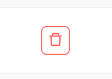

#  Оборудование

Здесь Администратор имеет возможность управлять моделями gps-трекеров, хостами и портами.
Для этого на странице расположены 3 вкладки с соответствующим функционалом.

## Модели трекеров

Здесь предоставлен список моделей [трекеров](/ru/trackers/intro), которые доступны в системе для выбора пользователям.

### Создание новой модели трекера
1. Нажать кнопку `Добавить новую модель трекера`.

2. Заполнить форму в соответствии с документацией gps-устройства.

3. Нажать кнопку `Создать`.

### Редактирование модели трекера
1. Нажать кнопку редактирования  у нужной модели. 
2. В открывшейся форме изменить необходимые данные.

3. Нажать кнопку `Редактировать`.

### Удаление модели трекера
1. Нажать кнопку удаления у нужной модели. 

 

2. Подтвердить удаление модели трекера нажатием кнопки `Удалить`.

## Управление хостами

:::warning Внимание
    Страница находится в разработке.
:::

## Управление портами

:::warning Внимание
    Страница находится в разработке.
:::
