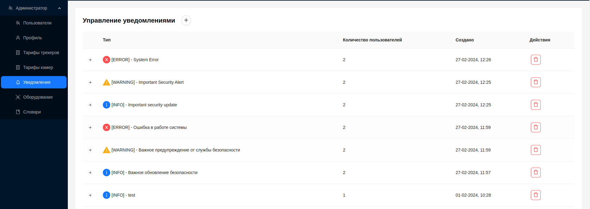
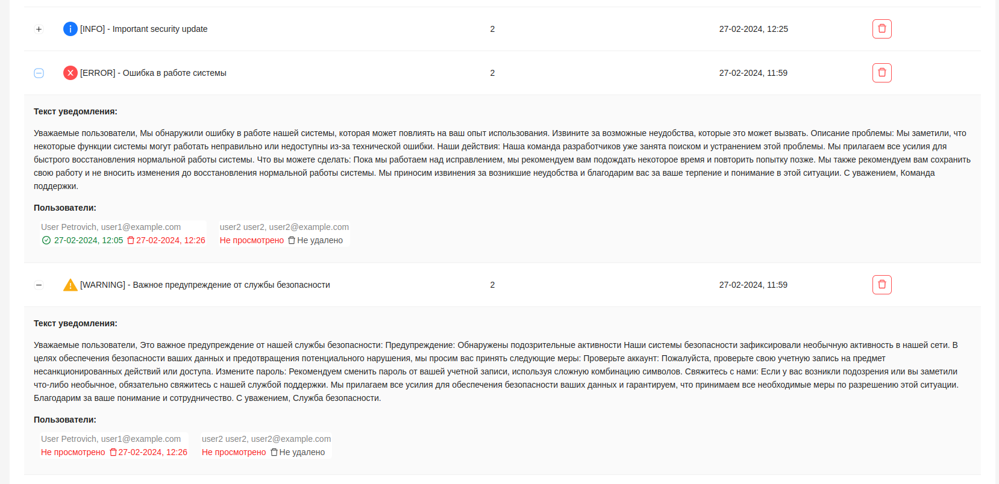
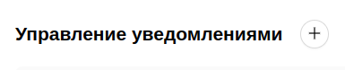
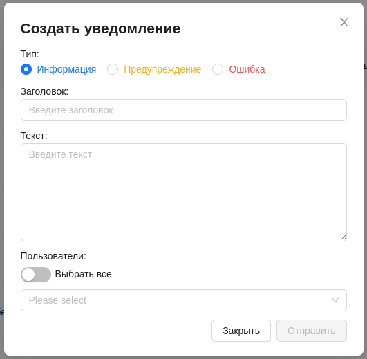
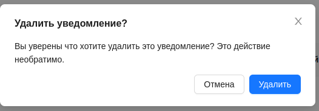

#  Управление уведомлениями

Администратор может создавать уведомления для пользователей и управлять их отправкой. На странице уведомлений предоставлена информация о всех уведомлениях с возможностью их просмотра.

Общая информация которая доступна администратору, это тип уведомления, заголовок, количество пользователей, которым отправлено уведомление и дата создания.
Каждую запись в таблице можно развернуть и просмотреть более детальную информацию:

- Текст уведомления.
- Пользователи, которым было отправлено уведомление, с указанием их почты и имени.
- Дата просмотра уведомления, если оно было просмотрено, либо запись ***Не просмотрено***.
- Дата удаления уведомления, если оно было удалено пользователем, либо запись ***Не удалено***.

## Создание уведомлений

1. Для создания нового уведомления администратору необходимо нажать кнопку вверху страницы.

2. После этого, появится форма создания нового уведомления.

3. Выбрать тип уведомления - ***Инфоррмация***, ***Предупреждение*** или ***Ошибка***.
4. Ввести заголовок уведомления.
5. Ввести текст уведомления.
6. Выбрать из выпадающего списка, каким пользователям необходимо отправить уведомление. При включении опции ***Выбрать все***, для отправки уведомления будут выбраны все пользователи платформы.
7. Нажать кнопку `Отправить`. 

## Удаление уведомлений

1. Для удаления уведомления из списка необходимо нажать на красную кнопку со значком корзины.

2. После чего подтвердить действие кнопкой `Удалить`.

