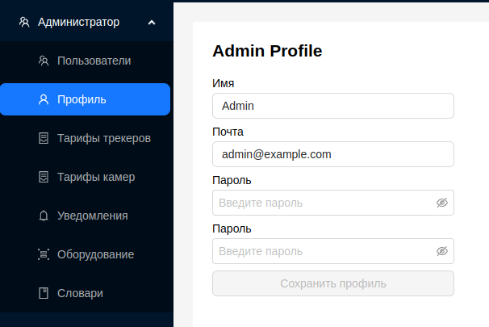

#  Профиль

Страница профиля администратора позволяет редактировать информацию об администраторе.

Администратор может редактировать следующие поля:
1. Имя администратора
2. Почта
3. Пароль
4. Поле для повторного ввода пароля

Для сохранения данных необходимо нажать кнопку `Сохранить профиль`.