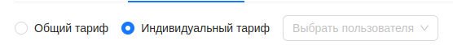

#  Тарифы трекеров

Администратор имеет возможность создавать новые тарифы трекеров, а так же просматривать информацию по ним. Для этого на странице тарифов трекеров имеется 2 вкладки:

## Список тарифов

:::warning Внимание
    Страница находится в разработке.
:::

## Создание нового тарифа трекера

1. Перейти на вкладку ***Создать новый тариф***.
2. Выбрать, каким будет являтся тариф - общим либо индивидуальным.

- Если тариф является общим - он будет доступен всем пользователям платформы для выбора.
- Если тариф является индивидуальным, Администратору необходимо выбрать из выпадающего списка пользователя, которому будет доступен этот тариф. Другие пользователи не смогут им воспользоваться.

3. Заполнить форму создания тарифа - указать необходимые значения а так же возможности трекера по этому тарифу.

4. Нажать кнопку `Создать тариф`.  

После этого новый тариф станет доступен всем пользователям, для которых он был создан.