#  Управление пользователями

Администратор видит список всех пользователей платформы. На странице отображается общая информация о пользователях - наименование, e-mail, телефон, дата регистрации в системе. Так же имеются кнопки для [редактирования](/ru/admin/users#редактирование-пользователя), [удаления](/ru/admin/users#удаление-пользователя), [подключения](/ru/admin/users#подключение-пользователя) и [пополнения баланса](/ru/admin/users#пополнение-баланса-пользователя) пользователя.

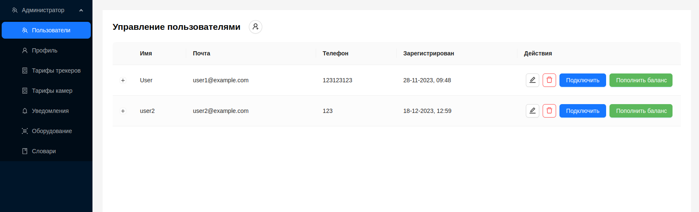 

## Детальная информация о пользователе

Администратор может нажать на значок `+` в первой колонке строки пользователя чтобы просмотреть детальную информацию о пользователе.

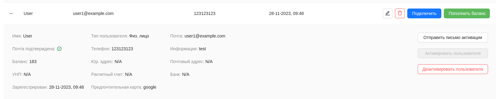 

Здесь предоставлена следующая информация:
1. Имя - имя пользователя.
2. Почта подтверждена - индикатор подтверждения почты пользователем.
3. Баланс - текущий баланс пользователя.
4. УНП - идентификационный номер налогоплательщика.
5. Зарегестрирован - дата регистрации пользователя.
6. Тип пользователя - Физ. лицо или Юр. лицо.
7. Телефон - номер телефона пользователя.
8. Юр.адрес.
9. Расчетный счет.
10. Почта - электронная почта пользователя.
11. Информация - дополнительная информация о пользователе.
12. Почтовый адрес.
13. Банк.
14. Предпочтительная карта

Кнопки:

1. `Отправить письмо активации` - при нажатии отправляет пользователю на указанную почту письмо для активации аккаунта.
2. `Активировать пользователя` - при нажатии переводит пользователя в активный статус с предоставлением доступа к возможностям платформы.
3. `Деактивировать пользователя` - при нажатии переводит пользователя в неактивный статус с ограничением доступа к возможностям платформы.

## Создание нового пользователя Администратором
Процесс создания нового пользователя Администратором аналогичен [регистрации нового пользователя](/ru/#регистрация) в системе.
1. Для создания нового пользователя Администратуру нужно нажать на кнопку вверху страницы.

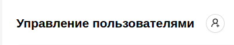 

2. Ввести данные пользователя в открывшуюся форму.

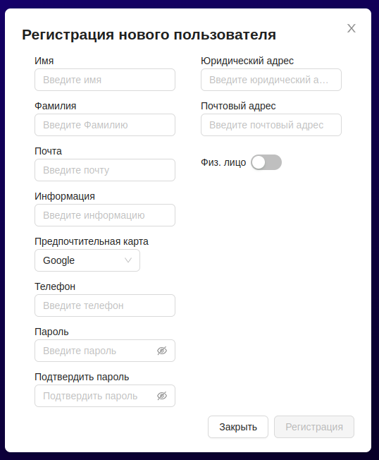 

3. Нажать кнопку `Регистрация`.

4. Пользователь добавиться в общий список в неактивном статусе. При необходимости нажать кнопку `Активировать пользователя` для активации аккаунта.

## Редактирование пользователя

1. Нажать кнопку редактирования  у пользователя.
2. Изменить данные у пользователя в открывшейся форме.

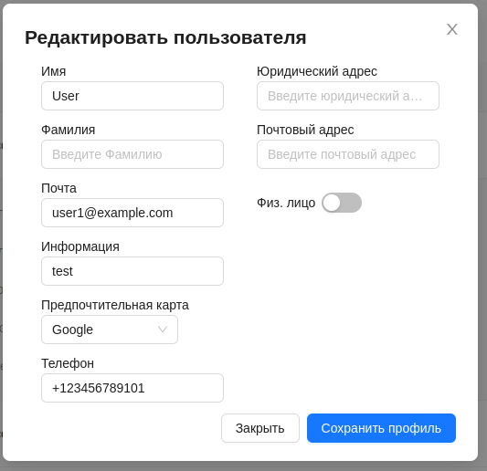 

3. Нажать кнопку `Сохранить профиль`.

## Подключение пользователя

Платформа предоставляет Администратору возможность управления системой от имени пользователя. Благодаря этому Администратор может получить доступ к обьектам мониторинга, трекерам и камерам пользователя, его интерфейсу с некоторыми дополнительными возможностями.

Для того чтобы Администратору подключить пользователя, необходимо у выбранного пользователя нажать синюю кнопку `Подключить`.

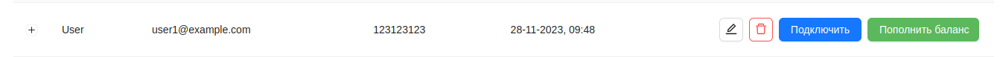 

После этого интерфейс Адмнистратора примет следующий вид:
1. В боковой панели, кроме возможностей Администратора появится дополнительные секции, повторяющие набор боковой панели пользователя.
2. В верхней панели появится e-mail пользователя, к которому в данный момент подключен Администратор. Слева от него находится мигающий индикатор соединения, а справа кнопка для отключения пользователя от Администратора.

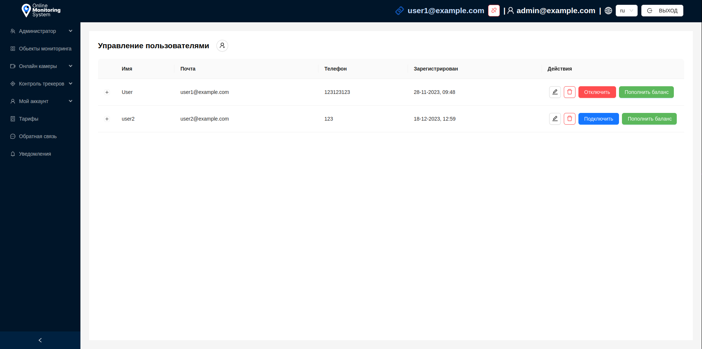 

В этом режиме Администратор может выполнять от имени пользователя следующие функции:
1. Просматривать, редактировать, добавлять, удалять [обьекты мониторинга](/ru/category/monitoring-objects), [трекеры](/ru/category/trackers-management), [камеры](/ru/category/online-cameras), делиться с ними.
2. Просматривать [историю операций](/ru/myAccount/balance) пользователя и совершать [платежи по тарифам](/ru/myAccount/payments).
3. Просматривать доступные пользователю [тарифы](/ru/tariffs).
4. Оставлять [обратную связь](/ru/feedback) от имени пользователя.
5. Просматривать [уведомления](/ru/notifications) пользователя.
6. [Пополнять баланс](/ru/admin/users#пополнение-баланса) пользователя или [отменять последние операции](/ru/admin/users#отмена-операций).

### Отключение пользователя

Для того чтобы Администратору выйти из режима подключения пользователя, необходимо в верхней панели нажать на кнопку отключения.

 

Либо нажать кнопку `Отключить` на странице пользователей, у конкретного пользователя.

## Управление балансом пользователя

### Пополнение баланса
Администратор имеет возможность пополнять баланс выбранного пользователя. Сделать это можно двумя способами:

***Через страницу пользователей***:
1. Необходимо у пользователя нажать зеленую кнопку `Пополнить баланс`.

 

2. В открывшемся окне указать сумму пополнения.

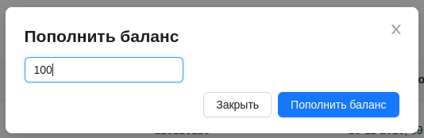 

3. Нажать кнопку `Попоплнить баланс`.

***Через режим [подключения пользователя](/ru/admin/users#подключение-пользователя)***

1. Необходимо подключить пользователя, нажав на кнопку `Подключить`.

 

2. Перейти на страницу ***Мой аккаунт/Баланс***.
3. Здесь Администратору доступна кнопка `Пополнить баланс`, которую необходимо нажать. 

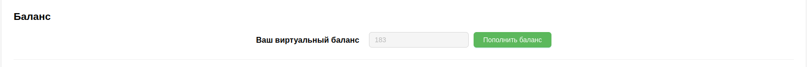 

4. В открывшемся окне указать сумму пополнения.

 

5. Нажать кнопку `Попоплнить баланс`.

### Отмена операций

Администратор имеет возможность отменить операции пользователя.
Для этого необходимо:
1. Перейти в  режим [подключения пользователя](/ru/admin/users#подключение-пользователя).
2. Перейти на страницу ***Мой аккаунт/Баланс***.
3. Для последней совершенной операции, Администратору будет доступна кнопка `Отмена`.

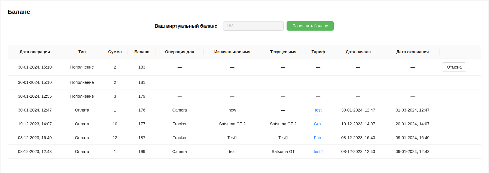 

4. Нажать на кнопку `Отмена` для отмены последней операции. После этого эта операция пропадет из списка, и для отмены станет доступна следующая за ней операция. Значение баланса вернется к значению до совершения отмененной операции.
## Удаление пользователя

1. Нажать кнопку удаления у нужного пользователя. 

 

2. Подтвердить удаление пользователя нажатием кнопки `Удалить`.

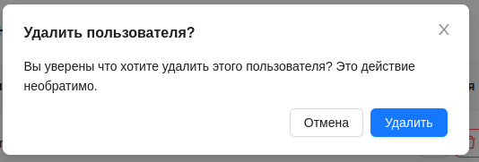

