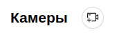
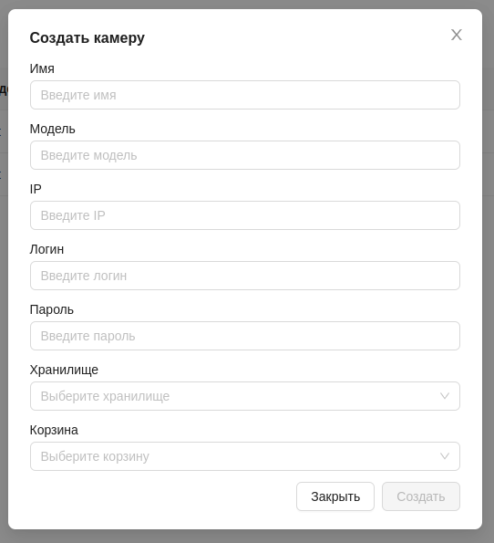

#  Добавление камеры
1. Для добавления новой видеокамеры необходимо на странице **Камеры** нажать на кнопку вверху страницы.

2. После чего появится форма, которую необходимо заполнить:

- Имя - название камеры для определения его пользователем.
- Модель - используемая модель камеры.
- IP - IP-адрес видеокамеры.
- Логин - логин для подключения к видеокамере.
- Пароль - пароль для подключения к видеокамере.
- Хранилище - выбор хранилища для сохранения видеозаписей. Подробнее в [соответствующем разделе](/ru/cameras/storages).
- Корзина - выбор корзины хранилища, для хранения видеозаписей. Подробнее в [соответствующем разделе](/ru/cameras/storages).

3. Нажать кнопку `Создать`. Если данные введены верно, в списке появится созданная видеокамера.

