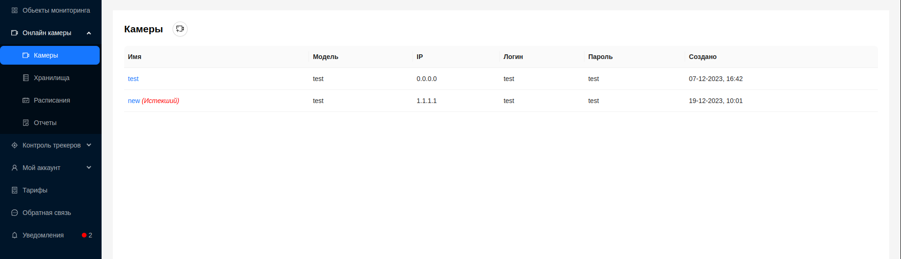
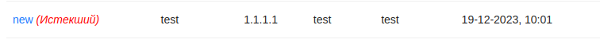
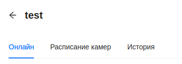
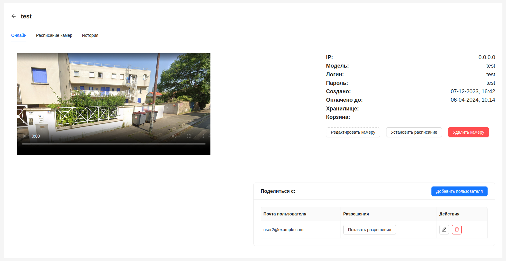
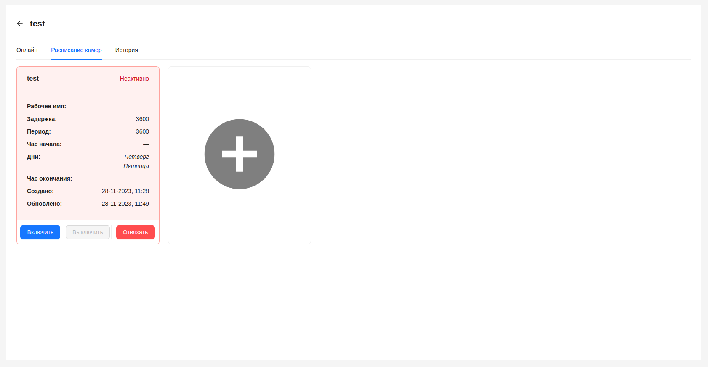
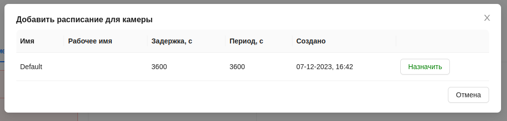

#  Камеры

Система предназначена для осуществления видеоконтроля за объектами наблюдения в режиме реального времени и предоставления детальной информации об объектах в режиме работы с историческими данными за указанные периоды.

## Интерфейс

На основной странице пользователю предоставлен основной список видеокамер.

Здесь предоставлена следующая информация по каждой камере:
1. Наименование
2. Модель камеры
3. IP-адрес
4. Логин для подключения к камере
5. Паролья для подключения к камере
6. Дата создания камеры

:::tip Справка

Если оплаченное время тарифа для видеокамеры истекло, она помечается как `Истекший`.

:::

## Детальная информация о камере

При нажатии на наименование камеры в общем списке, пользователь может перейти на страницу просмотра камеры.

Здесь имеется 3 вкладки с различной информацией:
- Онлайн 
- Расписание камер
- История

### Онлайн

На вкладке пользователю предоставлен плеер для онлайн-просмотра видеотрансляции с камеры. 
Так же имеется блок с детальной информацией о камере. Страница содержит функции [удаления камеры](/ru/cameras/deleteCamera), [редактирования](/ru/cameras/editCamera), [установки расписания](/ru/cameras/#расписание-камер) а так же предоставлении доступа другим пользователям([поделиться камерой](/ru/cameras/sharing)).

### Расписание камер

Вкладка предназначена для установки расписаний для камеры, по которым она будет работать, а так же их просмотра.

Расписания предоставлены в виде карточек, которые в зависимости от статуса расписания могут иметь зеленый либо красный цвет. Расписание может иметь один из двух статусов - **Активно/Неактивно**.

В активном статусе расписание используется камерой в текущий момент.

- Кнопка `Включить` переводит расписание в активный статус.
- Кнопка `Выключить` переводит расписание в неактивный статус.
- Кнопка `Отвязать` убирает расписание для текущей камеры.

Чтобы добавить новое расписание для камеры, необходимо нажать на пустую карточку со знаком **` + `**.

После чего откроется окно с таблицей, для выбора расписания из доступных для этой камеры.

Нажать кнопку `Назначить` у расписания, которое необходимо.

При отсутствии доступных расписаний, таблица будет пустая.
:::tip
**Более подробно о работе расписаний, их создании и управлении можно узнать в разделе [Расписания](/ru/cameras/schedules)**.
:::

### История

Здесь пользователю предоставлена информация о хранящихся видеозаписях с информацией о размере видеофайлов, периоде за который они были созданы, и их текущем статусе.

:::warning Внимание
    Страница находится в разработке.
:::