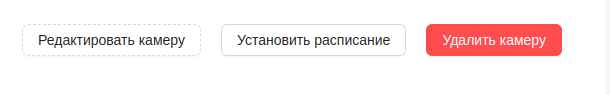

#  Редактирование камеры
1. Для редактиования видеокамеры необходимо на странице просмотра видеокамеры нажать на кнопку `Редактировать камеру`.

2. После чего появится форма с данными камеры:

3. После внесения изменений нажать кнопку `Редактировать` для их сохранения. 

