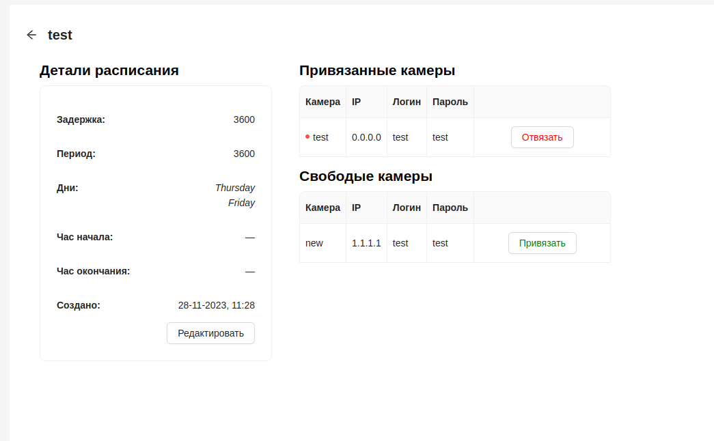

# Расписания

Система позволяет настраивать расписание работы видеокамер. 

## Интерфейс

В основной таблице отображены следующие данные по расписаниям:
- Наименование
- Задержка в секундах
- Период в секундах
- Дата создания

## Детальная информация о расписании

При клике на имя расписания в общем списке, пользователь попадает на страницу детальной информации о камере.

В блоке **Детали расписания** отображена подробная информация о расписании. Справа от него находится информация о камерах, в виде 2х таблиц:
- **Привязанные камеры** - видеокамеры, к которым привязано текущее раписание. Рядом с названием камеры находится индикатор в виде точки. Зеленая точка обозначает что раписание используется камерой в текущий момент, красный - что расписание привязано к камере но не используется в текущий момент.

 Отвязать расписание можно нажав кнопку `Отвязать`.

- **Свободные камеры** - видеокамеры, доступные для привязки к текущему расписанию. Привязка расписания происходит по нажатию кнопки `Привязать`.

## Создание расписания

1. Для добавления нового расписания необходимо на странице **Расписания** нажать на кнопку вверху страницы.

2. После чего появится форма, которую необходимо заполнить:

- Имя - наименование расписания
- Задержка, с - промежуток времени в секундах, в который камера не будет снимать.
- Период, с - промежуток времени в секундах, в который камера будет работать.
- Дни - для выбора дней недели, по котрым будет работать камера.
- Час начала - время начала работы видеокамеры.
- Час окончания - время окончания работы видеокамеры.
- Камеры - выпадающий список для выбора камер, которые будут работать по новому расписанию.

:::tip
При выставлении полей ***Задержка*** и ***Период*** значениями 3600, камера будет снимать непрерывно.
:::
3. Нажать кнопку `Создать`. Если данные введены верно, в списке появится созданное расписание.

## Редактирование расписания

1. Для редактиования расписания необходимо на его странице нажать на кнопку `Редактировать`.

2. После чего появится форма с данными расписания.

3. После внесения изменений нажать кнопку `Редактировать` для их сохранения. 

## Удаление расписания

1. Для удаления расписания необходимо на нажать на красную кнопку с иконкой корзины.

2. После чего подтвердите удаление кнопкой `Удалить`:

