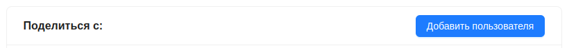
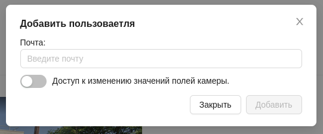
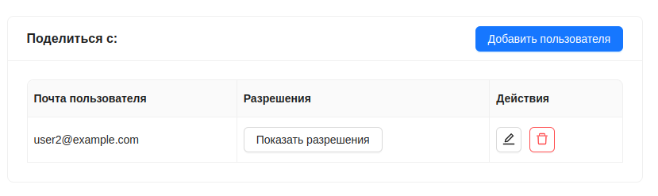
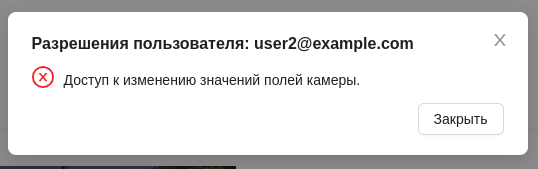
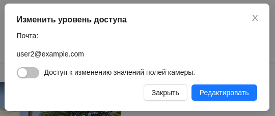
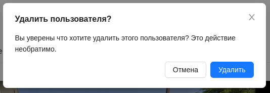
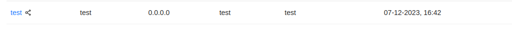

# Поделиться камерой

Система позволяет дать доступ к видеокамере другим пользователям(поделиться камерой).

Для того чтобы поделиться камерой с другим пользователем, на вкладке просмотра камеры нужно нажать на кнопку `Добавить пользователя`.

После этого появится окно в котором необходимо ввести почту пользователя, с которым нужно поделиться камерой, а так же указать разрешения(права) для этого пользователя. 

После этого нужно нажать кнопку `Добавить`.

При успешном предоставлении доступа другому пользователю, у владельца камеры появится информация о пользователе, которому предоставлен доступ.

Здесь пользователь - владелец камеры, может видеть почту пользователя, а так же совершить некоторые действия:

- просмотреть разрешения у этого пользователя, с помощью кнопки `Показать разрешения`

- редактировать разрешения у пользователя

- удалить пользователя из списка тех, кому предоставлен доступ к камере.

У пользователя, с которым поделились камерой, данная камера будет отображатся в общем списке камер со специальным значком.

:::warning Важно
Пользователь, которому предоставили доступ к камере, не может поделиться ей с другим пользователем или удалить эту камеру. Остальной функционал доступен ему в соответствии с выданными владельцем правами.
:::