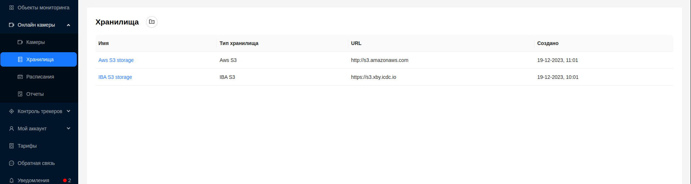
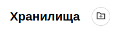
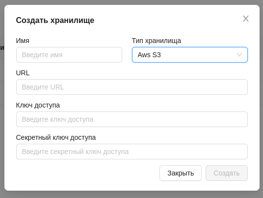
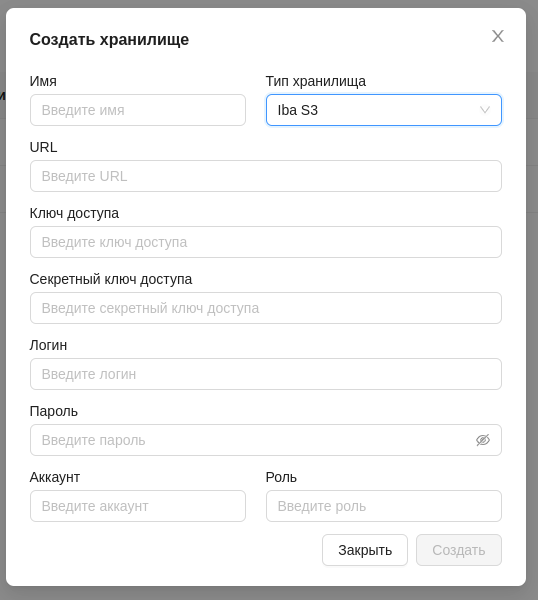
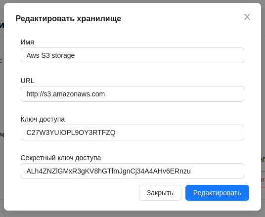
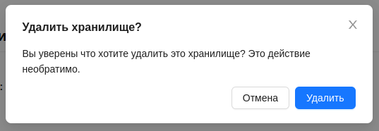

# Хранилища

Система предоставляет возможность использовать системы облачного хранилища AWS S3 и ICDC S3 для хранения данных с камер видеонаблюдения.

## Интерфейс 

Данная страница предоставляет пользователю информацию о доступных ему хранилищах в виде таблицы с возможностью управлять ими.

В таблице предоставлена следующая информация:
1. Наименование хранилища
2. Тип хранилища. Подробнее о типах смотрите [здесь](/ru/cameras/storages#поддержка-хранилища-данных-iba-s3-и-aws-s3).
3. URL-адрес хранилища.
4. Дата создания.

## Детальная информация о хранилище

:::warning Внимание
    Страница находится в разработке.
:::

## Добавление хранилища

1. Для добавления нового хранилища необходимо на странице **Хранилища** нажать на кнопку вверху страницы.

2. После чего появится форма, которую необходимо заполнить:

- Имя
- Тип хранилища - [Aws S3 или Iba S3](/ru/cameras/storages#поддержка-хранилища-данных-iba-s3-и-aws-s3)
- URL
- Ключ доступа
- Секретный ключ доступа

При выборе типа **Iba S3** необходимо заполнить дополнительные поля:
 
- Логин
- Пароль
- Название аккаунта
- Роль

3. Нажать кнопку `Создать`. Если данные введены верно, в списке появится созданное хранилище.

## Поддержка хранилища данных: IBA S3 и AWS S3

Наша система предоставляет пользователям возможность выбора между двумя типами хранилищ данных: IBA S3 и AWS S3. Обе платформы предлагают широкие возможности для хранения и управления данными, обеспечивая высокий уровень надежности, доступности и масштабируемости.

- IBA S3 представляет собой надежное и гибкое хранилище данных, разработанное с учетом требований корпоративных клиентов. Оно обеспечивает высокую степень защиты данных, включая шифрование в покое и в движении, а также механизмы контроля доступа. IBA S3 также предлагает гибкую систему тарификации и расширенные возможности администрирования.

- AWS S3 (Amazon Simple Storage Service) - это ведущая в отрасли платформа облачного хранения, предоставляемая Amazon Web Services. Она обеспечивает безопасное и масштабируемое хранение данных с высокой доступностью и надежностью. AWS S3 предлагает широкий набор инструментов для управления данными, включая автоматизацию, мониторинг и аналитику.

Выбор между IBA S3 и AWS S3:
Пользователи могут выбирать между IBA S3 и AWS S3 в зависимости от их предпочтений, требований к безопасности данных, бюджета и других факторов. Обе платформы обеспечивают высокий уровень производительности и функциональности, что позволяет пользователям эффективно управлять своими данными в соответствии с их потребностями и бизнес-целями.

## Редактирование хранилища

1. Для редактиования хранилища необходимо на его странице нажать на кнопку `Редактировать`.

2. После чего появится форма с данными хранилища.

3. После внесения изменений нажать кнопку `Редактировать` для их сохранения. 

## Удаление хранилища

1. Для удаления хранилища необходимо на его странице нажать на кнопку `Удалить хранилище`.

2. После чего подтвердите удаление кнопкой `Удалить`:

