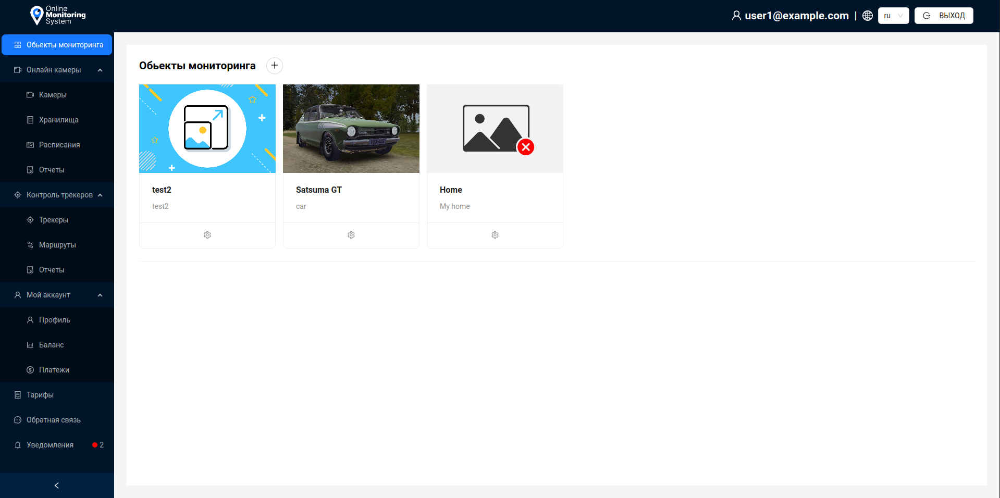

# Введение

Платформа **ZakodixOMS** - комплексная платформа видеонаблюдения и спутникового мониторинга транспортных средств. Включает в себя функционал по контролю и отслеживанию объектов, предоставлению детальной информации об объекте как в режиме реального времени, так и исторические данные по заданным периодам.

## Авторизация

Для входа в ZakodixOMS пользователю необходимо авторизоваться, заполнив поля `Почта` пользователя и `Пароль`.

После заполнения всей информации нажать на кнопку `Войти`.

### Регистрация

Для регистрации нового пользователя в системе, необходимо нажать кнопку `Регистрация` и заполнить в открывшейся форме нуобходимые поля.

- Поле `Предпочтительная карта` необходимо для выбора провайдера географических карт.
- При изменении поля `Физ. лицо` на `Юр. лицо` появятся дополнительные поля, необходимые для заполнения.
- Пароль должен быть не менее 8 символов.

### Восстановление пароля

Для восстановление пароля необходимо нажать кнопку `Забыли пароль?`. В появившемся окне нужно написать свою почту, указанную при регистрации.

После чего нажать кнопку `Отправить ссылку на почту`.

Вам на почту придет ссылка для восстановления пароля, после перехода по которой вы сможете указать новый пароль для входа.

## Интерфейс платформы

Интерфейс платформы представляет собой несколько визуальных блоков:

- Боковая панель навигации:
1. `Обьекты мониторинга` - переход к списку обьектов мониторинга пользователя.
2. `Онлайн камеры` - категория функционала, связанного с видеонаблюдением и управлением видеокамерами.
3. `Камеры` - переход к списку видеокамер пользователя.
4. `Хранилища` - переход к списку хранилищ пользователя.
5. `Расписания` - переход к списку расписаний для видеокамер пользователя.
6. `Отчеты` - переход к странице формирования отчетов по видеокамерам.
7. `Контроль трэкеров` - категория функционала, связанного с системой мониторинга обьектов и управлением трэкерами.
8. `Трэкеры` - переход к списку трэкеров пользователя.
9. `Маршруты` - переход к странице формирования маршрутов трэкеров пользователя.
10. `Отчеты` -  переход к странице формирования отчетов по трэкерам.
11. `Мой аккаунт` - категория функционала, связанного с управлением аккаунтом пользователя.
12. `Профиль` - переход к форме редактирования профиля пользователя.
13. `Баланс` - переход к списку истории операций пользователя и просмотра баланса.
14. `Платежи` - переход к странице оплаты тарифов для трэкеров/видеокамер пользователя.
15. `Тарифы` - переход к списку тарифов пользователя.
16. `Отзыв` - переход к форме обратной связи.
17. `Уведомления` - переход к списку уведомлений пользователя.

- Верхняя информационная панель:
1. Информация(почта) текущего пользователя.
2. Выпадающее меню для выбора текущего языка платформы.
3. Кнопка `Выход` для выходы и возврата на страницу авторизации.

- Основное окно для работы с платформой.

:::tip Администратор

Элементы навигационной и информационной панели, могут отличаться у пользователя с правами Администратора. Подробнее смотрите в п. **Администратор**.

:::