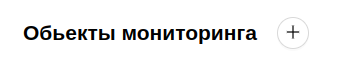
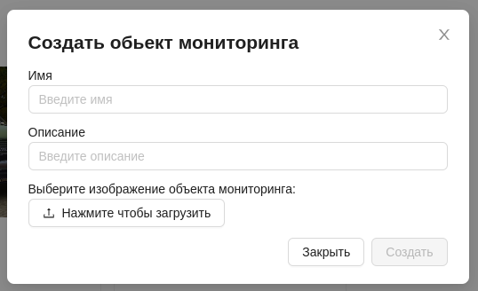

#  Добавление обьекта мониторинга
1. Для добавления нового обьекта мониторинга необходимо на главнойстранице **Обьекты мониторинга** нажать на кнопку вверху страницы.

2. После чего появится форма, которую необходимо заполнить:

- Имя - название обьекта мониторинга для определения его пользователем.
- Описание - более подробное описание обьекта мониторинга.
- Кнопка для загрузки изображения, идентифицирующего обьект мониторинга.

3. Нажать кнопку `Создать`. Если данные введены верно, на странице появится новый обьект мониторинга.

