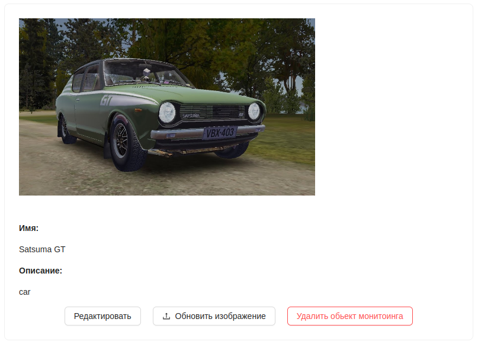
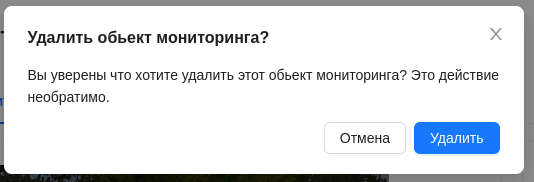

#  Удаление обьекта мониторинга
1. Для удаления обьекта мониторинга необходимо на его странице нажать на кнопку `Удалить обьект мониторинга` у нужного трекера.

2. После чего подтвердите удаление кнопкой `Удалить`:

:::warning Внимание!
    Удалить обьект мониторинга, которым поделился другой пользователь, нельзя!
:::

