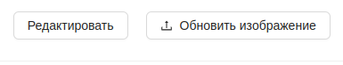
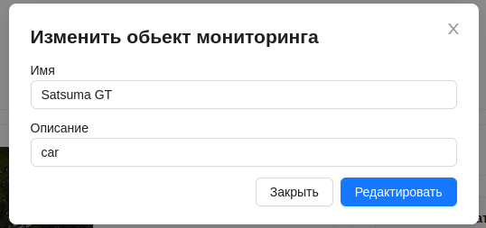

#  Редактирование обьекта мониторинга
Для редактиования обьекта мониторинга необходимо на его странице размещены 2 кнопки:

1. При нажатии кнопки `Редактировать` появится форма редактирования для обьекта мониторинга, с возможностью изменить его имя и описание. Для сохранения изменений в форме нужно нажать кнопку `Редактировать`.

2. Кнопка `Обновить изображение` предназначена для обновления изображения обьекта мониторинга путем его загрузки.

:::warning Внимание!
Обьем загружаемых изображений не должен превыщать 3Мб.
:::

